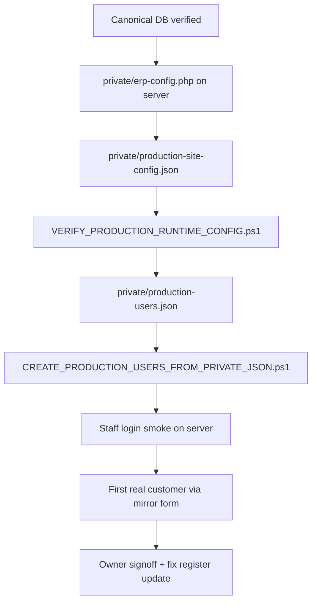

# MOGHARE360 V1 — Real Run Preparation

## Context

V1 is locked: canonical SQL Server schema, production signoff complete, legacy Codex MySQL is reference-only. This document describes how to move from **test/seed posture** to **controlled real production usage** without exposing credentials or private data in GitHub.

## Goals

1. Define real staff users on the server only (private JSON + import script).
2. Define real site/company presentation settings on the server only.
3. Execute the first real customer online request through the mirror → API → SQL Server path.
4. Produce runtime reports that stay outside Git.

## What stays out of GitHub

| Item | Location | Git |
|------|----------|-----|
| DB credentials | `private/erp-config.php` | ignored |
| Real users + passwords/hashes | `private/production-users.json` | ignored |
| Real site phones/address/URLs | `private/production-site-config.json` | ignored |
| Import / verify runtime output | `runtime/` | ignored |
| ZIP binaries | `release/*.zip` | ignored |

Templates under `private/templates/` are safe placeholders only.

## Preparation sequence (recommended)



### Step 1 — Database lock (already done)

```powershell
sqlcmd -S .\SQLEXPRESS -d moghare360_ERP -E -i public_html\sql\sqlserver\MOGHARE360_V1_DATABASE_VERIFY.sql
C:\xampp\php\php.exe tools\test-v1-canonical-database.php
```

### Step 2 — Server config

1. Copy `private/erp-config.example.php` → `private/erp-config.php` (on server).
2. Copy `private/templates/production-site-config.template.json` → `private/production-site-config.json`.
3. Fill real domain, phones, address, master/mirror URLs.

```powershell
.\tools\production\VERIFY_PRODUCTION_RUNTIME_CONFIG.ps1
```

### Step 3 — Production users

1. Copy `private/templates/production-users.template.json` → `private/production-users.json`.
2. Replace placeholder usernames/display names with real staff identities **on the server**.
3. Set `temporary_password_or_hash_placeholder` to either:
   - a **bcrypt hash** (`$2y$...`), or
   - a **one-time plain password** only in the private file (hashed at import; never logged).

```powershell
.\tools\production\CREATE_PRODUCTION_USERS_FROM_PRIVATE_JSON.ps1
```

Report: `runtime/PRODUCTION_USERS_IMPORT_REPORT.md` (gitignored).

### Step 4 — Readiness test

```powershell
C:\xampp\php\php.exe tools\test-v1-real-run-readiness.php
```

### Step 5 — First real customer (controlled)

Follow `MOGHARE360_V1_FIRST_REAL_CUSTOMER_RUN.md`. Use mirror form only (`/api/customer/request.php`). Do not activate legacy `submit-customer.php`.

## Prohibitions

- No DROP / TRUNCATE / destructive SQL for cleanup.
- No real customer data in seed SQL or templates.
- No committing `private/production-*.json` or `runtime/` reports with real data.
- No legacy MySQL activation.

## Related documents

- `MOGHARE360_V1_PRODUCTION_USER_ACCESS_PLAN.md`
- `MOGHARE360_V1_FIRST_REAL_CUSTOMER_RUN.md`
- `MOGHARE360_V1_CANONICAL_DATABASE_LOCK.md`
- `MOGHARE360_V1_PRODUCTION_RUN_SIGNOFF.md`
