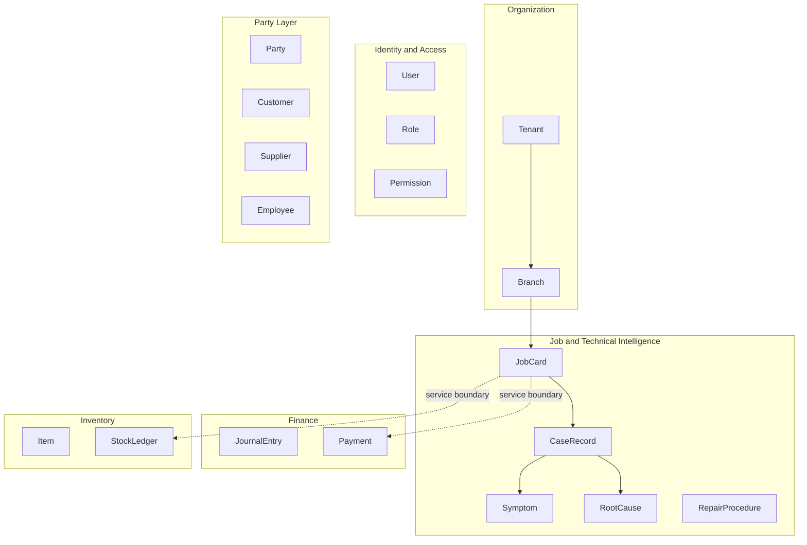

# APEX 03 — High-Level Logical Entity Map

## Important Disclaimer

This document defines a **logical, high-level entity map** for architecture discussion and domain model design.

- **This is NOT a physical schema.**
- **This is NOT a table list.**
- **No SQL, no migrations, and no physical tables** are defined here.
- Physical schema design begins only after architecture sign-off and data ownership rules approval.

Entities below represent **domain concepts and aggregates**, not database table names.

---

## Core Platform Entities

| Entity | Domain | Description |
|--------|--------|-------------|
| **Tenant** | Organization | Top-level organizational tenant (workshop group / operator) |
| **Branch** | Organization | Physical or logical workshop branch |
| **User** | Identity & Access | System user account |
| **Role** | Identity & Access | Named role bundle |
| **Permission** | Identity & Access | Atomic authorization capability |

---

## Party Layer

| Entity | Domain | Description |
|--------|--------|-------------|
| **Party** | CRM / shared reference | Canonical party identity (person or organization) |
| **Customer** | CRM | Customer relationship view of a party |
| **Supplier** | Procurement | Supplier relationship view of a party |
| **Employee** | HR | Employee relationship view of a party |

*Party is a shared reference concept; each specialized view is owned by its domain with anti-corruption boundaries.*

---

## Finance Entities

| Entity | Domain | Description |
|--------|--------|-------------|
| **Account** | Finance | Chart of accounts entry |
| **JournalEntry** | Finance | Accounting journal header |
| **LedgerEntry** | Finance | Posted ledger line |
| **BankAccount** | Finance | Cash/bank account |
| **Payment** | Finance | Payment transaction |
| **CreditProfile** | Finance | Customer/vendor credit posture |

---

## Inventory Entities

| Entity | Domain | Description |
|--------|--------|-------------|
| **Item** | Inventory | Stock item / part / material |
| **Warehouse** | Inventory | Storage location |
| **StockLedger** | Inventory | Stock movement ledger |
| **ReorderPolicy** | Inventory | Replenishment rules |

---

## Procurement Entities

| Entity | Domain | Description |
|--------|--------|-------------|
| **RFQ** | Procurement | Request for quotation |
| **PurchaseOrder** | Procurement | Purchase order |
| **GRN** | Procurement | Goods receipt note |
| **PurchaseInvoice** | Procurement | Vendor invoice |
| **VendorRating** | Procurement | Supplier performance rating |

---

## CRM Entities

| Entity | Domain | Description |
|--------|--------|-------------|
| **Lead** | CRM & Marketing | Prospective customer |
| **Campaign** | CRM & Marketing | Marketing campaign |
| **Appointment** | CRM & Marketing | Scheduled customer visit |
| **SourceAttribution** | CRM & Marketing | Lead/customer source tracking |

---

## HR Entities

| Entity | Domain | Description |
|--------|--------|-------------|
| **Skill** | HR | Technician skill definition |
| **Attendance** | HR | Attendance record |
| **TechnicianPerformance** | HR | KPI and productivity metrics |
| **BonusRule** | HR | Performance-based bonus rule |

---

## Job & Operations Entities

| Entity | Domain | Description |
|--------|--------|-------------|
| **JobCard** | Job & Technical Intelligence | Primary operational work order |
| **JobStep** | Job & Technical Intelligence | Workflow step on a job |
| **QCChecklist** | Job & Technical Intelligence | Quality control checklist |
| **WarrantyRecord** | Job & Technical Intelligence | Warranty case linkage |

---

## Technical Intelligence Entities

| Entity | Domain | Description |
|--------|--------|-------------|
| **CaseRecord** | Job & Technical Intelligence | Structured technical case |
| **Symptom** | Job & Technical Intelligence | Classified symptom |
| **RootCause** | Job & Technical Intelligence | Identified root cause |
| **RepairProcedure** | Job & Technical Intelligence | Documented repair steps |
| **FailurePattern** | Job & Technical Intelligence | Aggregated failure statistics |
| **SuggestionRule** | Job & Technical Intelligence | Rule-based suggestion definition |

---

## Logical Relationship Overview

Solid lines = logical ownership within domain. Dotted lines = **must** cross service boundaries only.

---

## Cursor Statement

This map is logical only. **Cursor did not decide the next roadmap step.**
