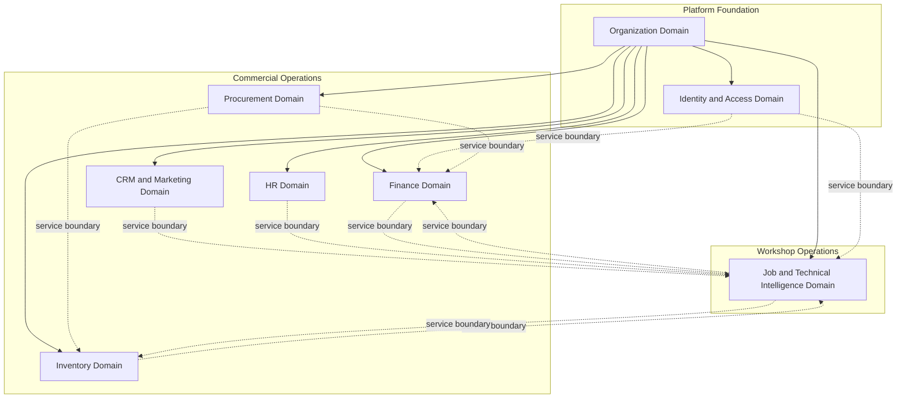

# APEX 10 — Logical Domain Model Overview

## Phase

**APEX PHASE 1 — Logical Domain Model Diagram**

## Clean Restart Position

**Step 2 of 5:** Design Logical Domain Model Diagram

| Step | Name | Status |
|------|------|--------|
| 1 | Freeze Architecture | Complete (Phase 0) |
| 2 | Design Logical Domain Model Diagram | **This phase** |
| 3 | Approval & Sign-Off | Pending |
| 4 | Define Data Ownership Rules | Preliminary (Phase 0) |
| 5 | Start Physical Schema Design | Blocked |

---

## Purpose of Phase 1

Phase 1 converts the frozen high-level entity map (APEX 03) into **per-domain logical models**, **cross-domain interaction maps**, and **service boundary previews**.

This package supports architecture review and sign-off before any physical data design.

---

## Hard Constraints (Logical Only)

| Constraint | Statement |
|------------|-----------|
| Logical model only | Entities are domain concepts, not database tables |
| Not physical schema | No table definitions, no column structure |
| No SQL | No scripts, no migrations, no DDL |
| No database work | No connection, config, or runtime changes |
| Service boundaries | Cross-domain links are API/service interactions only |
| No direct table access | Domains must not touch another domain's persistence |

---

## Eight Locked Domains

---

## Phase 1 Document Map

| Document | Content |
|----------|---------|
| APEX_11 | Organization Domain logical model |
| APEX_12 | Identity & Access Domain logical model |
| APEX_13 | Finance Domain logical model |
| APEX_14 | Procurement Domain logical model |
| APEX_15 | Inventory Domain logical model |
| APEX_16 | CRM & Marketing Domain logical model |
| APEX_17 | HR Domain logical model |
| APEX_18 | Job & Technical Intelligence Domain logical model |
| APEX_19 | Cross-domain interaction map |
| APEX_20 | Service boundary preview |
| APEX_21 | Review notes and open questions |

---

## Relationship to Phase 0

Phase 0 froze product scope, domain boundaries, and high-level entities. Phase 1 adds **intra-domain relationships**, **aggregate boundaries**, and **inter-domain service flows** — still without physical schema.

---

## Cursor Statement

Cursor implemented Phase 1 documentation only. **Cursor did not decide the next roadmap step.**
