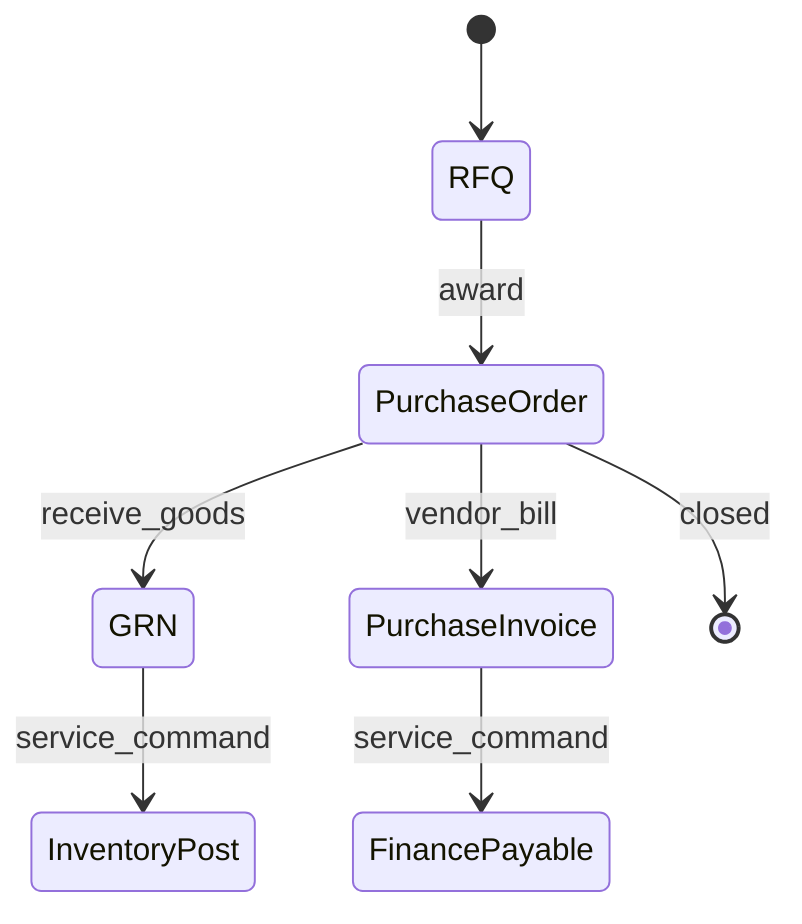

# APEX 14 — Procurement Domain Logical Model

## Domain

**Procurement Domain** — domestic and foreign purchasing, landed cost, and vendor lifecycle.

**Logical only. Not physical schema. No SQL.**

---

## Logical Entities

| Entity | Role |
|--------|------|
| **RFQ** | Request for quotation to vendors |
| **PurchaseOrder** | Committed purchase against a vendor |
| **GRN** | Goods receipt note (physical receipt event) |
| **PurchaseInvoice** | Vendor invoice for reconciliation |
| **VendorRating** | Supplier performance score |
| **LandedCostEstimate** | Total landed cost projection (freight, duty, fees) |

---

## Responsibilities

- Domestic procurement workflow
- Foreign procurement workflow
- Supplier purchasing document lifecycle
- Landed cost tracking and allocation logic
- Vendor performance rating
- Handoff to Inventory (receipt) and Finance (payable) via services

---

## Does Not Own

| Area | Owning Domain |
|------|---------------|
| Stock ledger final truth | Inventory |
| Accounting ledger truth | Finance |
| Supplier party master (canonical) | Shared party ref; procurement owns supplier relationship view |

---

## Logical Diagram

```mermaid
erDiagram
    RFQ ||--o{ PurchaseOrder : may_convert
    PurchaseOrder ||--o{ GRN : receives
    PurchaseOrder ||--o{ PurchaseInvoice : invoiced
    PurchaseOrder ||--o| LandedCostEstimate : estimates
    PurchaseOrder }o--|| VendorRating : influences
  GRN }o--|| PurchaseOrder : fulfills

    PurchaseOrder {
        string po_ref logical
        string procurement_type logical
        string status logical
    }
    LandedCostEstimate {
        string estimate_ref logical
        string cost_components logical
    }
```

---

## Document Lifecycle (Logical)



*InventoryPost and FinancePayable are **service boundary commands**, not table writes.*

---

## Service Boundary Notes

| Exposed (preview) | Description |
|-------------------|-------------|
| `createPurchaseOrder(command)` | Start PO |
| `recordGRN(command)` | Record receipt; triggers inventory service |
| `registerPurchaseInvoice(command)` | Triggers finance payable service |
| `getLandedCostEstimate(po_ref)` | Query landed cost |

| Consumed | Via |
|----------|-----|
| Stock posting | InventoryService.receiveFromGRN |
| Payable registration | FinanceService.registerPayable |
| Supplier reference | Party/supplier ref contract |

---

## Cursor Statement

**Cursor did not decide the next roadmap step.**
