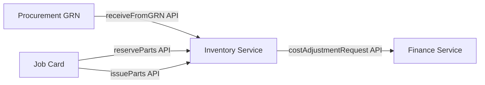

# APEX 15 — Inventory Domain Logical Model

## Domain

**Inventory Domain** — item catalog, warehouses, stock truth, reservations, and reorder control.

**Logical only. Not physical schema. No SQL.**

---

## Logical Entities

| Entity | Role |
|--------|------|
| **Item** | Catalog entry for part, material, or consumable |
| **Warehouse** | Storage location (may map to branch) |
| **StockLedger** | Authoritative stock movement history |
| **ReorderPolicy** | Replenishment threshold and rules |
| **StockReservation** | Quantity reserved for a job or order |
| **StockMovement** | Individual issue, receipt, transfer, adjustment event |

---

## Responsibilities

- Item catalog maintenance
- Warehouse structure
- **Stock truth** — sole authority for on-hand and reserved quantities
- Reservation lifecycle for JobCards and internal use
- Reorder signal generation
- Stock movement audit trail

---

## Does Not Own

| Area | Owning Domain |
|------|---------------|
| Purchase contract and PO truth | Procurement |
| Finance ledger and valuation posting rules | Finance |
| JobCard technical diagnosis | Job & Technical Intelligence |
| Repair procedure definition | Job & Technical Intelligence |

---

## Logical Diagram

```mermaid
erDiagram
    Item ||--o{ StockLedger : tracked_in
    Warehouse ||--o{ StockLedger : location
    Item ||--o{ StockReservation : reserved
    Item ||--o| ReorderPolicy : policy
    StockMovement }o--|| StockLedger : records
    StockReservation }o--|| JobCardRef : for_job_logical_ref

    StockLedger {
        string ledger_ref logical
        string quantity_on_hand logical
        string quantity_reserved logical
    }
    StockReservation {
        string reservation_ref logical
        string status logical
        string source_domain logical
    }
```

*`JobCardRef` is a cross-domain reference ID only — not a local aggregate root.*

---

## Stock Flow (Service Boundary)



---

## Service Boundary Notes

| Exposed (preview) | Description |
|-------------------|-------------|
| `getStockLevel(item_ref, warehouse_ref)` | On-hand query |
| `reserveStock(command)` | Reserve for job |
| `issueStock(command)` | Consume reserved stock |
| `receiveFromGRN(command)` | Post receipt from procurement |
| `transferStock(command)` | Inter-warehouse move |
| `evaluateReorder()` | Reorder recommendations |

No other domain updates `StockLedger` directly.

---

## Cursor Statement

**Cursor did not decide the next roadmap step.**
