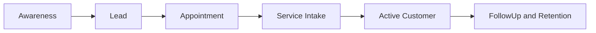

# APEX 16 — CRM & Marketing Domain Logical Model

## Domain

**CRM & Marketing Domain** — leads, campaigns, appointments, attribution, and customer journey.

**Logical only. Not physical schema. No SQL.**

---

## Logical Entities

| Entity | Role |
|--------|------|
| **Lead** | Prospective customer opportunity |
| **Campaign** | Marketing campaign definition and tracking |
| **Appointment** | Scheduled visit or service intake slot |
| **SourceAttribution** | Channel/source credit for lead or customer |
| **CustomerJourney** | Stage tracking from awareness through service and retention |
| **FollowUp** | Scheduled follow-up action or reminder |

---

## Responsibilities

- Lead capture and source attribution
- Campaign performance tracking
- Appointment generation and scheduling
- Follow-up logic and retention touchpoints
- Customer journey before and after workshop service
- Customer relationship view (not financial or technical truth)

---

## Does Not Own

| Area | Owning Domain |
|------|---------------|
| Customer financial credit truth | Finance |
| JobCard technical truth and repair state | Job & Technical Intelligence |
| Payment and invoice truth | Finance |
| User login identity | Identity & Access |

---

## Logical Diagram

```mermaid
erDiagram
    Campaign ||--o{ Lead : generates
    Lead ||--o| SourceAttribution : attributed
    Lead ||--o{ Appointment : schedules
    Lead ||--o{ CustomerJourney : progresses
    CustomerJourney ||--o{ FollowUp : triggers
    Appointment }o--|| JobIntakeRef : may_convert

    Lead {
        string lead_ref logical
        string status logical
        string channel logical
    }
    SourceAttribution {
        string attribution_ref logical
        string source_code logical
    }
```

*`JobIntakeRef` is a service boundary reference to Job domain intake — not owned here.*

---

## Customer Journey Stages (Logical)



Stage `Service Intake` hands off to Job domain via API.

---

## Service Boundary Notes

| Exposed (preview) | Description |
|-------------------|-------------|
| `captureLead(command)` | Register new lead with attribution |
| `scheduleAppointment(command)` | Book appointment |
| `convertToJobIntake(appointment_ref)` | Request job intake in Job domain |
| `scheduleFollowUp(command)` | Create follow-up task |
| `getCustomerJourney(party_ref)` | Journey query |

| Consumed | Via |
|----------|-----|
| Job intake creation | JobTechnicalService.createIntake |
| Credit check (optional) | FinanceService.checkCredit |

---

## Cursor Statement

**Cursor did not decide the next roadmap step.**
