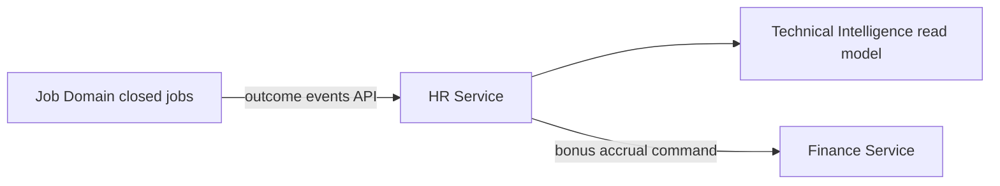

# APEX 17 — HR Domain Logical Model

## Domain

**HR Domain** — employee operational profile, skills, attendance, performance, and productivity.

**Logical only. Not physical schema. No SQL.**

---

## Logical Entities

| Entity | Role |
|--------|------|
| **Employee** | Operational employee profile (not login account) |
| **Skill** | Skill definition and certification level |
| **Attendance** | Attendance and presence record |
| **TechnicianPerformance** | KPI and outcome metrics for technicians |
| **BonusRule** | Performance-based bonus calculation rule |
| **ProductivityMetric** | Time, throughput, and efficiency measures |

---

## Responsibilities

- Employee operational master (HR view)
- Skill inventory and technician capability matrix
- Attendance tracking
- Technician performance measurement
- KPI and productivity analytics for operations
- Bonus rule definition (calculation triggers; payroll posting is Finance)

---

## Does Not Own

| Area | Owning Domain |
|------|---------------|
| Login and user identity | Identity & Access |
| Ledger and payroll accounting truth | Finance |
| JobCard technical diagnosis and repair steps | Job & Technical Intelligence |
| Job workflow gates | Job & Technical Intelligence |

---

## Logical Diagram

```mermaid
erDiagram
    Employee ||--o{ EmployeeSkill : has
    Skill ||--o{ EmployeeSkill : defines
    Employee ||--o{ Attendance : records
    Employee ||--o{ TechnicianPerformance : measured
    Employee ||--o{ ProductivityMetric : tracked
    BonusRule ||--o{ TechnicianPerformance : applies_to

    Employee {
        string employee_ref logical
        string person_ref logical
        string user_ref logical
    }
    TechnicianPerformance {
        string performance_ref logical
        string period logical
        string kpi_score logical
    }
```

*`user_ref` links to Identity domain — HR does not store credentials.*

---

## Performance Data Flow (Logical)



Job outcomes feed performance metrics via **events/API**, not direct HR writes to Job aggregates.

---

## Service Boundary Notes

| Exposed (preview) | Description |
|-------------------|-------------|
| `getEmployee(employee_ref)` | Employee profile query |
| `getTechnicianSkills(employee_ref)` | Skill matrix for assignment |
| `recordAttendance(command)` | Attendance entry |
| `getPerformanceSummary(employee_ref, period)` | KPI query |
| `evaluateBonus(period)` | Bonus calculation (Finance posts separately) |

| Consumed | Via |
|----------|-----|
| User linkage | IdentityAccessService.getUserContext |
| Job outcome events | JobTechnicalService event stream |

---

## Cursor Statement

**Cursor did not decide the next roadmap step.**
