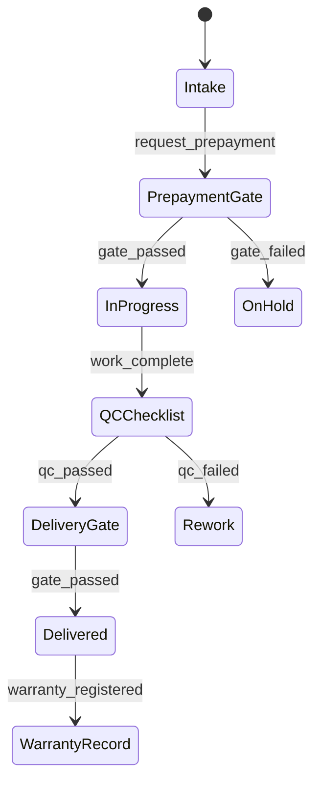
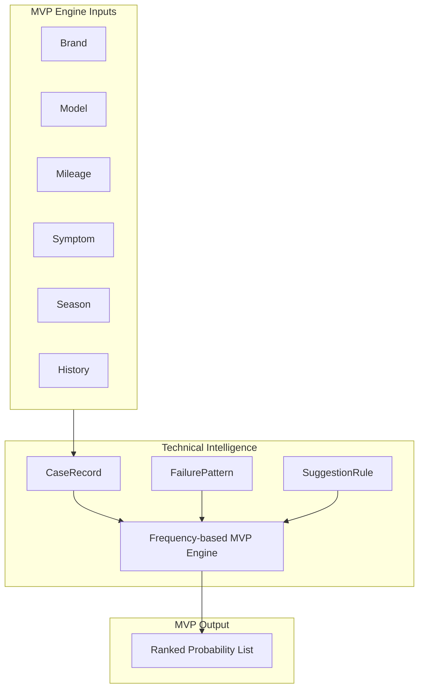
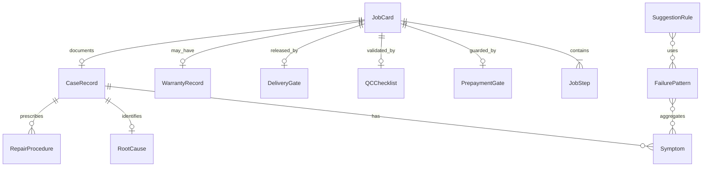

# APEX 18 — Job & Technical Intelligence Domain Logical Model

## Domain

**Job & Technical Intelligence Domain** — workshop operations, workflow gates, and technical memory engine.

**Logical only. Not physical schema. No SQL.**

---

## Job Logical Entities

| Entity | Role |
|--------|------|
| **JobCard** | Primary operational work order |
| **JobStep** | Workflow step on a job (diagnosis, repair, test) |
| **QCChecklist** | Quality control checklist and results |
| **WarrantyRecord** | Warranty case linked to delivered job |
| **PrepaymentGate** | Financial gate before work proceeds |
| **DeliveryGate** | Controlled delivery authorization gate |

---

## Technical Intelligence Logical Entities

| Entity | Role |
|--------|------|
| **CaseRecord** | Structured technical case linked to job |
| **Symptom** | Classified symptom entry |
| **RootCause** | Identified root cause |
| **RepairProcedure** | Documented repair steps |
| **FailurePattern** | Aggregated failure statistics |
| **SuggestionRule** | Rule-based suggestion definition |

---

## Responsibilities

- JobCard operational lifecycle (intake → prepayment → work → QC → delivery → warranty)
- Workflow gate enforcement (prepayment, QC, delivery)
- Technical case memory and structured diagnosis
- Failure pattern learning (frequency aggregation)
- Rule-based suggestion MVP
- Foundation for future ML and cross-workshop learning (Phase 2+)

---

## Does Not Own

| Area | Owning Domain |
|------|---------------|
| Ledger truth | Finance |
| Stock ledger truth | Inventory |
| HR employee master truth | HR |
| CRM campaign truth | CRM & Marketing |
| User credentials | Identity & Access |

---

## JobCard Lifecycle (Logical)

Gates call Finance (prepayment) and internal QC rules — **via service boundary**, not ledger mutation.

---

## Technical Intelligence (Logical)

### MVP Engine

**Frequency-based engine** — symptom/root-cause frequency tables, brand/model segmentation, seasonal weighting, explicit rules. Explainable rankings.

### Future Engine (Phase 2+)

**ML model** trained on cross-workshop anonymized dataset; predictive maintenance; technician recommendation. Extends MVP — does not replace Job operational truth.

---

## Full Domain Diagram

---

## Service Boundary Notes

| Exposed (preview) | Description |
|-------------------|-------------|
| `createJobIntake(command)` | Start job from CRM or walk-in |
| `requestPrepaymentCheck(job_ref)` | Trigger Finance credit/payment check |
| `reserveParts(job_ref, lines)` | Inventory reservation |
| `recordQCResult(command)` | QC gate update |
| `authorizeDelivery(job_ref)` | Delivery gate |
| `getSuggestions(case_context)` | Technical Intelligence ranked list |
| `closeCase(case_ref, outcome)` | Close case; emit events for HR/TI stats |

| Consumed | Via |
|----------|-----|
| Prepayment / invoice | FinanceService |
| Parts reserve/issue | InventoryService |
| Technician skills | HRService |
| Customer ref | CRMService |

---

## Cursor Statement

**Cursor did not decide the next roadmap step.**
