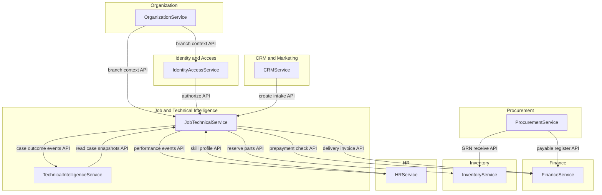
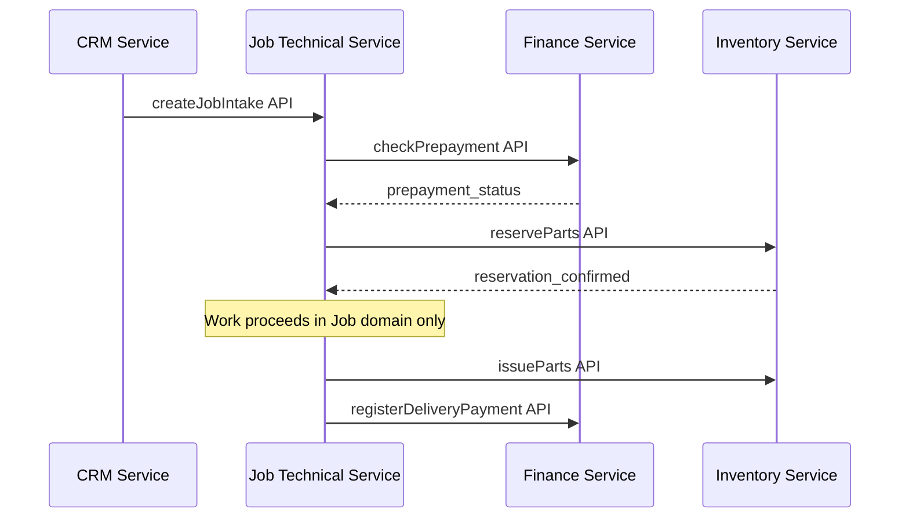

# APEX 19 — Cross-Domain Interaction Map

## Purpose

Logical map of **how domains interact** in ApexMahinERP. Every interaction is a **service/API boundary** — never direct cross-domain table access.

**Logical only. Not physical schema. No SQL.**

---

## Core Rule

> **No direct cross-domain table access.**
> All interactions below are labeled as **service/API boundary**.

---

## Interaction Overview

---

## Interaction Catalog

| # | Source | Target | Interaction | Boundary Type |
|---|--------|--------|-------------|---------------|
| 1 | Job | Inventory | Job requests inventory reservation for JobCard | service/API |
| 2 | Job | Finance | Request prepayment check before work | service/API |
| 3 | Job | Finance | Request delivery invoice / final payment | service/API |
| 4 | Procurement | Inventory | Post GRN receipt to stock | service/API |
| 5 | Procurement | Finance | Register vendor payable from purchase invoice | service/API |
| 6 | CRM | Job | Create appointment → job intake request | service/API |
| 7 | HR | Job | Provide technician skill profile for assignment | service/API |
| 8 | Job | HR | Emit closed-job performance events | service/API event |
| 9 | Job | Technical Intelligence | Provide structured case outcomes | service/API event |
| 10 | Technical Intelligence | Job | Return ranked suggestions (read-only advisory) | service/API query |
| 11 | Identity | All | Authorize user action in domain context | service/API |
| 12 | Organization | All | Resolve branch/tenant scope | service/API |

---

## Example Flow: Job with Prepayment and Parts

No step involves cross-domain persistence access.

---

## Anti-Patterns (Forbidden)

| Anti-Pattern | Correct Pattern |
|--------------|-----------------|
| Job module writes stock quantity | `InventoryService.issueStock(command)` |
| Procurement inserts ledger entry | `FinanceService.registerPayable(command)` |
| CRM updates JobCard status | `JobTechnicalService.createIntake(command)` |
| Technical Intelligence updates JobCard | Advisory only; Job owns state |
| HR stores password hash | Identity & Access owns credentials |

---

## Cursor Statement

**Cursor did not decide the next roadmap step.**
