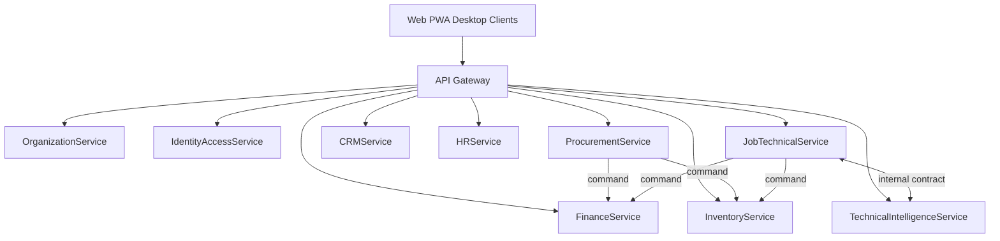

# APEX 20 — Service Boundary Preview

## Purpose

Early preview of **domain-facing services** for ApexMahinERP. This is **not** an API contract, OpenAPI spec, or implementation — it previews how domains will expose operations in an API-first architecture.

**Logical only. Not physical schema. No SQL.**

---

## Preview Principles

| Principle | Rule |
|-----------|------|
| One service family per domain | Clear ownership |
| Commands vs queries | Write operations are commands; reads are queries |
| No direct table mutation exposure | Services hide persistence |
| API-first | Web, PWA, and desktop clients consume these boundaries |
| Anti-corruption | Consumers use DTOs, not domain internals |

---

## OrganizationService

| Attribute | Value |
|-----------|-------|
| **Owns** | Organization Domain |
| **Operations (preview)** | `resolveBranch`, `listBranches`, `getTenantContext`, `registerBranch` |
| **Does not expose** | Raw organizational persistence mutation to other domains |
| **API-first relevance** | Scope key for every client request header/context |

---

## IdentityAccessService

| Attribute | Value |
|-----------|-------|
| **Owns** | Identity & Access Domain |
| **Operations (preview)** | `authenticate`, `authorize`, `assignRole`, `revokeRole`, `getUserContext`, `requestElevatedAccess` |
| **Does not expose** | Credential storage paths; direct permission table access |
| **API-first relevance** | Every API call passes through authorization |

---

## FinanceService

| Attribute | Value |
|-----------|-------|
| **Owns** | Finance Domain |
| **Operations (preview)** | `checkCredit`, `registerPayment`, `postJournalFromSource`, `registerPayable`, `registerReceivable`, `getLedgerBalance` |
| **Does not expose** | Direct ledger line insertion from external callers |
| **API-first relevance** | Payment widgets, AR/AP dashboards, prepayment gates |

---

## ProcurementService

| Attribute | Value |
|-----------|-------|
| **Owns** | Procurement Domain |
| **Operations (preview)** | `createRFQ`, `createPurchaseOrder`, `recordGRN`, `registerPurchaseInvoice`, `rateVendor`, `getLandedCost` |
| **Does not expose** | Inventory stock writes; finance posting internals |
| **API-first relevance** | Purchasing desk, foreign PO tracking, landed cost UI |

---

## InventoryService

| Attribute | Value |
|-----------|-------|
| **Owns** | Inventory Domain |
| **Operations (preview)** | `getStockLevel`, `reserveStock`, `issueStock`, `receiveFromGRN`, `transferStock`, `evaluateReorder` |
| **Does not expose** | Procurement PO state; job repair logic |
| **API-first relevance** | Parts counter, warehouse mobile PWA, job parts picker |

---

## CRMService

| Attribute | Value |
|-----------|-------|
| **Owns** | CRM & Marketing Domain |
| **Operations (preview)** | `captureLead`, `scheduleAppointment`, `convertToJobIntake`, `scheduleFollowUp`, `getCustomerJourney`, `attributeSource` |
| **Does not expose** | JobCard mutation; credit limits |
| **API-first relevance** | Lead inbox, campaign dashboard, appointment booking |

---

## HRService

| Attribute | Value |
|-----------|-------|
| **Owns** | HR Domain |
| **Operations (preview)** | `getEmployee`, `getTechnicianSkills`, `recordAttendance`, `getPerformanceSummary`, `evaluateBonus` |
| **Does not expose** | Login credentials; ledger payroll postings |
| **API-first relevance** | Technician roster, skill matrix, KPI boards |

---

## JobTechnicalService

| Attribute | Value |
|-----------|-------|
| **Owns** | Job & Technical Intelligence Domain (operational aggregate) |
| **Operations (preview)** | `createJobIntake`, `advanceJobStep`, `requestPrepaymentGate`, `submitQC`, `authorizeDelivery`, `registerWarranty`, `closeJob` |
| **Does not expose** | Stock ledger; journal entries |
| **API-first relevance** | Workshop floor PWA, QC station, delivery desk |

---

## TechnicalIntelligenceService

| Attribute | Value |
|-----------|-------|
| **Owns** | Job & Technical Intelligence Domain (intelligence sub-area) |
| **Operations (preview)** | `createCase`, `classifySymptom`, `recordRootCause`, `getSuggestions`, `aggregateFailurePatterns`, `publishRule` |
| **Does not expose** | JobCard state mutation; inventory or finance writes |
| **API-first relevance** | Diagnosis assistant, ranked cause panel, technical memory search |

*May be deployed as a module within Job domain service host; logically distinct anti-corruption surface.*

---

## Service Topology (Preview)

---

## Cursor Statement

**Cursor did not decide the next roadmap step.**
