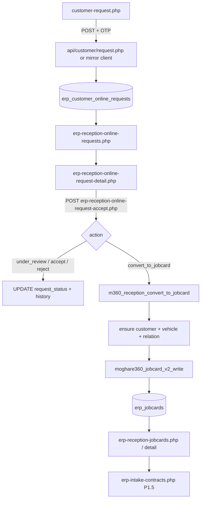
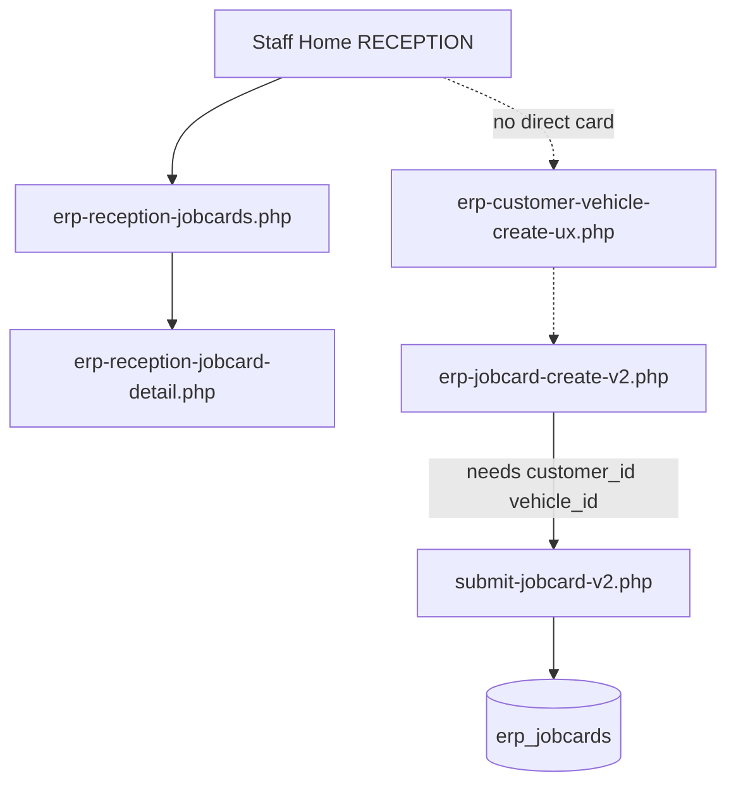

# MOGHARE360 P11.9-C-0 — Reception / Intake / JobCard Discovery Report

**Phase:** P11.9-C-0  
**Mode:** Report only — no code, SQL, Auth, or workflow changes  
**Date:** 2026-07-04  
**Product:** MOGHARE360 V1 RC

---

## 1. Executive Summary

Reception in MOGHARE360 V1 RC is implemented as **disconnected P1 (online requests) and P2 (reception JobCards) list/detail pages**, plus **P1.5 intake contracts**, reachable from **Staff Home** (`erp-staff-home.php`) for the `RECEPTION` role. There is **no unified Reception Workbench** matching the owner’s professional dashboard vision.

**What works today (partial):**

- Public online intake: `customer-request.php` → `api/customer/request.php` → `erp_customer_online_requests`
- Reception list/detail for online requests: `erp-reception-online-requests.php`, `erp-reception-online-request-detail.php`
- POST action handler: `erp-reception-online-request-accept.php` (under_review, accept, reject, convert_to_jobcard)
- JobCard conversion logic exists in `m360_reception_convert_to_jobcard()` with customer/vehicle/relation creation
- Reception JobCard board/detail/actions: `erp-reception-jobcards.php`, `erp-reception-jobcard-detail.php`, `erp-reception-jobcard-action.php`
- Intake contracts (P1.5): `erp-intake-contracts.php` and related generate/send/sign pages
- Camera capture (Wave 2A): `erp-jobcard-camera-capture.php` (camera-only; not wired into reception intake flow)
- Customer/vehicle read-only workbench: `erp-customer-vehicle-workbench.php`

**Critical gaps blocking dry-run quality:**

1. **«ERP security validation failed.»** on convert/reject (and likely other actions) — **CSRF token regeneration bug** on detail page (four forms each call `erp_csrf_input()` for the same purpose, overwriting the session token; only the last rendered form matches session).
2. **Online request detail is not a complete intake file** — read-only field grid + action buttons; no defect selection, photos, diag attachment, belongings checklist, or cost/terms capture in one reception file.
3. **No dedicated offline/walk-in reception form** — walk-in path is fragmented (`erp-jobcard-create-v2.php` requires pre-existing `customer_id`/`vehicle_id`; customer/vehicle create UX is separate).
4. **Filter UX appears ineffective** — filter SQL exists, but homogeneous test data (mostly `NEW`/`MIRROR`/`تست`) and overlapping `NEW`/`PENDING` filter semantics make status pills look unchanged.
5. **Reception UI** uses legacy `moghare360-soft-run-release.css` tables, not the green MOGHAREH360 operational workbench the owner expects.
6. **HR shortcuts** for reception staff are **backlog only** (P15) in Staff Home helper.

**Stop / Continue:** **CONTINUE** — gaps are fixable within controlled UI/workflow phases without Auth architecture, permission model, or P12 scope changes. Some items need owner approval before schema expansion.

---

## 2. Owner Observations Interpreted

| # | Observation | Interpretation | Evidence |
|---|-------------|----------------|----------|
| 1 | Status filters on online requests list seem ineffective | Filters are wired in `m360_reception_list_requests()` but test DB likely has few distinct statuses; `NEW` filter includes both `NEW` and `PENDING` while UI also shows separate `PENDING` pill — confusing overlap | `erp-reception-online-requests.php`, `m360-reception-helper.php` L57–64 |
| 2 | Detail page is not a complete reception/intake file | Correct — detail is summary grid + actions only | `erp-reception-online-request-detail.php` |
| 3 | Accept / under-review show confirmation | Only **convert** and **reject** have `onsubmit confirm()` in code; accept/under_review submit directly — owner may be grouping UX or seeing browser/native prompts | detail L121–132 |
| 4 | Convert / reject → «ERP security validation failed» | **CSRF failure** — plain text from `erp_csrf_require_valid()` catch block | `erp-customer-core-helper.php` L58–68; detail has 4× `erp_csrf_input(M360_RECEPTION_CSRF_PURPOSE)` |
| 5 | Reception UI visually weak | P1 pages use soft-run release CSS + plain tables; P2 jobcards board has operational shell but P1 online pages do not | `erp-reception-online-requests.php` vs `erp-reception-jobcards.php` |
| 6 | Reception must cover online + offline + full intake | Only online list/detail + separate JobCard board exist; offline is not one guided flow | No `erp-reception-walk-in*.php` |
| 7 | Reception needs card-based workbench | Staff Home has role cards but not owner’s full reception dashboard (HR, walk-in, incomplete files, customer response) | `m360-staff-home-helper.php` RECEPTION group |
| 8 | Weak test data pollution | `MIRROR` source channel, `تست` names, `TEST_V1_CANONICAL_DB_DO_NOT_USE` patterns from mirror/API test paths | `customer-request.php` `PUBLIC_WEB`; legacy API `MIRROR`; owner observation |
| 9 | Prior blueprint/docs should be consolidated | P11.7 workbench coverage, P11.9-0/1 dry-run maps, P11.9-B preflight JobCard plan, P1/P1.5/P2 code — aligned but reception shell gap documented as backlog | See §12 references |

---

## 3. Current Reception Flow

### 3.1 Online customer request → JobCard

### 3.2 Offline / walk-in (current)

There is **no single offline admission wizard** linking customer identity → vehicle → intake fields → contract → JobCard.

### 3.3 Discovery Questions — Direct Answers

| # | Question | Answer |
|---|----------|--------|
| 1 | Current online → JobCard flow? | `customer-request.php` → DB online requests → reception list/detail → `erp-reception-online-request-accept.php` → `m360_reception_convert_to_jobcard()` → `erp_jobcards` |
| 2 | Current offline/walk-in flow? | Fragmented: create customer/vehicle separately, then `erp-jobcard-create-v2.php` or reception board after JobCard exists; Staff Home points to jobcards board not walk-in form |
| 3 | Offline reception form exists? | **No unified form.** Partial: `erp-jobcard-create-v2.php`, `erp-customer-vehicle-create-ux.php` |
| 4 | Complete intake form exists? | **No.** Detail pages are summary + actions, not full intake file |
| 5 | Customer profile exists? | **Yes** — `customer-profile.php` (customer); staff read-only `erp-customer-vehicle-workbench.php` |
| 6 | Vehicle profile exists? | **Partial** — `erp-vehicle-detail-ux.php`, workbench vehicle tab |
| 7 | Vehicle status / customer response page? | **Partial** — `api/customer/profile-status.php`; no reception «پاسخ به مشتری» workbench page |
| 8 | Defect/category selection? | **No dedicated module** in public_html |
| 9 | Photo capture? | **Yes** — `erp-jobcard-camera-capture.php` (camera-only); not integrated into P1 reception intake |
| 10 | Initial diagnostic capture? | **Partial** — `initial_inspection_notes` on reception jobcard detail POST; `diagnosis_summary` on technical phase |
| 11 | Intake contract? | **Yes** — `erp-intake-contracts.php`, detail, generate, send, `customer-intake-contract.php` |
| 12 | Cost/terms agreement? | **In contract template** — `includes/m360-contract-template-render.php`; not on online request detail |
| 13 | Customer OTP confirmation? | **Yes** on public request — `m360-otp-helper`; convert requires `otp_verified` in payload/row |
| 14 | Online → JobCard conversion? | **Yes** — `m360_reception_convert_to_jobcard()` |
| 15 | Why «ERP security validation failed»? | **CSRF token invalid** at `erp_csrf_require_valid()` — likely multi-form token overwrite on detail page |
| 16 | CSRF/session/method/token/permission? | **CSRF primary**; POST-only handler correct; staff session required via `m360_reception_require_staff()`; no separate permission guard on reception actions beyond staff login |
| 17 | Proper POST + CSRF? | **POST yes; CSRF pattern broken** — one token per page required, not per form |
| 18 | Filter buttons filtering data? | **Code yes** — `WHERE request_status = ?` (NEW includes PENDING); **visible effect weak** if data homogeneous |
| 19 | Statuses mapped correctly? | **Mostly yes** — constants in `m360-online-request-helper.php`; DB must store canonical codes (`CONVERTED_TO_JOBCARD`, etc.) |
| 20 | Test/demo pollution? | **Yes** — MIRROR/PUBLIC_WEB test submissions, repeated mobiles, placeholder names |
| 21 | Missing for real reception workbench? | Unified dashboard, offline wizard, complete intake file, defect/photo/diag integration, HR shortcuts, customer response UI, green shell on P1 |
| 22 | UI-only fixes? | Workbench layout, P1 shell styling, filter UX labels, Persian flash errors, single CSRF token on detail |
| 23 | Workflow/action fixes? | CSRF fix, convert OTP defer path for dry run, optional accept-before-convert enforcement |
| 24 | DB/schema/SQL? | Only if new intake fields (defects, belongings, reception file completeness flags) — **needs approval** |
| 25 | Owner approval before expansion? | Full offline intake schema, HR integration, customer response module, demo data cleanup policy |

---

## 4. Current Reception Page Audit Matrix

| Page | Purpose | Current behavior | Current problem | Evidence | Severity | Recommended action | Requires code? | Requires SQL? | Requires approval? |
|------|---------|------------------|-----------------|----------|----------|-------------------|----------------|---------------|-------------------|
| `erp-reception-online-requests.php` | Online request list | GET list + status filter pills | Plain table; filters look ineffective; no workbench cards; links to master console | L15–22, L136–138 | HIGH | Reception workbench shell + filter UX fix + hide test rows | Yes | No | No |
| `erp-reception-online-request-detail.php` | Request detail + actions | Read-only grid + 4 POST forms | Not complete intake file; **4× CSRF regenerate**; raw security error on fail | L105–134 | **CRITICAL** | Single CSRF token; Persian error redirect; expand intake sections (later phase) | Yes | Maybe | Partial |
| `erp-reception-online-request-accept.php` | Action handler | POST-only; CSRF; status update / convert | CSRF fails when token stale | L18–19 | **CRITICAL** | Fix token issuance on detail page | Yes | No | No |
| `erp-reception-jobcards.php` | Reception JobCard board | Filtered list; operational shell | Walk-in entry not obvious; P1.5 gate warning | P2 board | MEDIUM | Add walk-in card link; workbench integration | Yes | No | No |
| `erp-reception-jobcard-detail.php` | JobCard reception detail | Shell strip + actions + notes fields | Partial intake only | P2 detail | MEDIUM | Link to contract, camera, completeness gate | Yes | Maybe | Partial |
| `erp-reception-jobcard-action.php` | JobCard POST actions | CSRF + workflow actions | Same multi-form CSRF risk on detail if multiple forms | action handler | MEDIUM | Audit forms on detail | Yes | No | No |
| `erp-intake-contracts.php` | P1.5 contract board | List + filter; shell | Not linked from online request detail | contracts board | MEDIUM | Workbench card + cross-links | Yes | No | No |
| `customer-request.php` | Public online intake | OTP + calendar + API submit | Test pollution into production list | public form | LOW | Demo row tagging/filter (later) | Yes | Maybe | Yes |
| `erp-staff-home.php` | Role workbench entry | RECEPTION «کار امروز» cards | Not owner’s full reception dashboard; HR backlog | staff home helper | HIGH | P11.9-C workbench phase | Yes | No | Partial |
| `erp-customer-vehicle-workbench.php` | Customer/vehicle lookup | Read-only search | Not reception response workbench | M34 UX | MEDIUM | Extend for reception Q&A | Yes | No | Partial |
| `erp-jobcard-create-v2.php` | JobCard create | Form needs IDs | Not walk-in friendly | create v2 | HIGH | Offline admission wizard | Yes | Maybe | Yes |
| `erp-jobcard-camera-capture.php` | Photos | Camera-only | Not in reception intake path | Wave 2A | MEDIUM | Link from intake file | Yes | No | No |

---

## 5. Online Request Lifecycle Matrix

| Lifecycle stage | Current status label (DB) | Expected Persian label | Current filter behavior | Current action behavior | Security issue? | Missing data? | Recommended fix |
|-----------------|---------------------------|------------------------|-------------------------|---------------------------|-----------------|---------------|-----------------|
| Submitted | `NEW` / `PENDING` | جدید / در انتظار بررسی | `NEW` filter matches both NEW+PENDING; separate `PENDING` pill also shown | No auto-action | No | OTP in payload | Collapse filter pills; show counts per status |
| Waiting Review | `PENDING` | در انتظار بررسی | Exact `PENDING` only | — | No | — | Align label with NEW filter or remove duplicate |
| Under Review | `UNDER_REVIEW` | در حال بررسی | Exact match filter | POST `under_review` (also used to set state) | **CSRF** | — | Fix CSRF; disable if already under review |
| Accepted | `ACCEPTED` | پذیرفته‌شده | Exact match filter | POST `accept` | **CSRF** | — | Fix CSRF; require before convert (policy) |
| Rejected | `REJECTED` | رد شده | Exact match filter | POST `reject` | **CSRF** | — | Fix CSRF; Persian flash not plain text |
| Converted to JobCard | `CONVERTED_TO_JOBCARD` | تبدیل به کارت کار | Exact match filter | POST `convert_to_jobcard` | **CSRF** + OTP gate | customer/vehicle/plate | Fix CSRF; dry-run OTP defer; completeness gate |

---

## 6. Offline / Walk-In Reception Requirement Matrix

| Requirement | Exists now? | Current page/file | Gap | Must-have Dry Run? | Must-have V1 product? | Recommended phase |
|-------------|-------------|-------------------|-----|-------------------|----------------------|-------------------|
| Customer identity | Partial | `erp-customer-vehicle-create-ux.php`, v2 write helpers | No single reception walk-in step | Yes | Yes | P11.9-C-2+ |
| Mobile | Partial | Online request / customer create | Walk-in mobile capture not unified | Yes | Yes | C-2 |
| Vehicle identity | Partial | `erp-vehicle-create-v2.php` | Not reception-guided | Yes | Yes | C-2 |
| Plate | Partial | Plate widget in `customer-request.php` | Not on walk-in form | Yes | Yes | C-2 |
| VIN/chassis | Partial | Payload fields / vehicle v2 | Not required on reception detail | Optional | Yes | C-3 |
| Mileage | Partial | JobCard create v2 `odometer` | Not on online detail | Yes | Yes | C-2 |
| Fuel level | No | — | Missing | Optional | Yes | C-3 / schema |
| Visible damage | No | — | Missing | Optional | Yes | C-3 |
| Customer complaint | Partial | `service_note` / `complaint_text` | Online only minimal | Yes | Yes | C-1 UI |
| Defect category | No | — | Missing | Optional | Yes | C-3+ |
| Photos | Partial | `erp-jobcard-camera-capture.php` | Not linked at intake | Optional | Yes | C-2 |
| Diag report | Partial | `initial_inspection_notes` (P2) | Not at online intake | Optional | Yes | C-3 |
| Reception contract | Yes | P1.5 intake contracts | After JobCard exists | Yes | Yes | P11.9-B dry run |
| Cost/terms agreement | Partial | Contract template | Not pre-JobCard on online detail | Yes | Yes | C-2 |
| Belongings checklist | No | Contract text only | No structured UI | Optional | Yes | C-3 / schema |
| Estimated delivery | Partial | `visit_date` online | Not walk-in field | Optional | Yes | C-2 |
| Consent/signature | Yes | `customer-intake-contract-sign.php` | Post-JobCard | Yes (defer OTP) | Yes | B dry run |
| OTP confirmation | Yes | `m360-otp-helper` | Blocks convert if not verified | Defer for dry run | Yes | C-1 policy |
| Conversion to JobCard | Yes | `m360_reception_convert_to_jobcard` | CSRF broken; OTP gate | Yes | Yes | **P11.9-C-1** |

---

## 7. Reception Workbench UX Matrix

| Card (owner) | Purpose | Existing route | Missing route | Priority | Notes |
|--------------|---------|----------------|---------------|----------|-------|
| پروفایل پرسنلی پذیرشگر | HR daily affairs | Staff Home backlog text only | `erp-hr-*` self-service | MEDIUM | P15 backlog in `m360-staff-home-helper.php` |
| پذیرش خودرو حضوری | Walk-in admission | `erp-jobcard-create-v2.php` (partial) | `erp-reception-walk-in.php` (concept) | **HIGH** | Needs wizard |
| درخواست‌های آنلاین مشتری | Online queue | `erp-reception-online-requests.php` | Workbench wrapper | HIGH | Exists but not card dashboard |
| تکمیل پرونده پذیرش | Complete intake file | `erp-reception-jobcard-detail.php` (partial) | Unified intake editor | **HIGH** | Online detail insufficient |
| تبدیل به کارت کار | Convert gate | Detail → accept.php | Visible gate checklist | **CRITICAL** | Blocked by CSRF |
| پروفایل خودرو | Vehicle profile | `erp-vehicle-detail-ux.php` | From reception context | MEDIUM | Read-only UX exists |
| پاسخ‌گویی به مشتری | Customer Q&A | `api/customer/profile-status.php` | Reception response UI | HIGH | No staff page |
| وضعیت خودروهای پذیرش‌شده امروز | Today’s admissions | `erp-reception-jobcards.php` filter | «today» filter card | MEDIUM | Add date filter |
| پرونده‌های ناقص | Incomplete files | — | Completeness query | HIGH | Needs rules + UI |
| هشدارهای پذیرش | Alerts | P1.5 gate alert on jobcards board | Central alert card | MEDIUM | Partial |

---

## 8. JobCard Conversion Matrix

| Source | Required data before conversion | Current conversion support | Current error | Security requirement | Audit requirement | Recommended controlled fix |
|--------|--------------------------------|----------------------------|---------------|---------------------|-------------------|---------------------------|
| Online request | OTP verified (payload/row), mobile, plate preferred, customer/vehicle resolvable | `m360_reception_convert_to_jobcard()` full pipeline | **CSRF plain text**; then «بدون تأیید OTP» if OTP missing | Staff session + valid CSRF | `erp_customer_online_request_history` | C-1: single CSRF; C-1: dry-run OTP defer flag (operator protocol) |
| Walk-in JobCard | `customer_id`, `vehicle_id`, complaint | `submit-jobcard-v2.php` / v2 write | Requires pre-existing IDs | Staff session | JobCard history | C-2 offline wizard |
| Reception board manual | Contract gate P1.5 for progression | `m360_reception_jobcard_apply_action` | P1.5 missing warning | CSRF per action | JobCard + contract events | B dry run contract path |

---

## 9. Security / CSRF / Permission Matrix

| Action | Route | Method | CSRF required? | Current CSRF/token status | Permission requirement | Error observed | Root cause hypothesis | Fix type |
|--------|-------|--------|----------------|---------------------------|------------------------|----------------|----------------------|----------|
| Under review | `erp-reception-online-request-accept.php` | POST | Yes | Token in form 1 of 4 — **stale** | Staff login | security validation failed | Multi `erp_csrf_input()` overwrite | UI/workflow |
| Accept | same | POST | Yes | Token in form 2 — **stale** | Staff login | same | same | UI/workflow |
| Convert to JobCard | same | POST | Yes | Token in form 3 — **stale** | Staff login | security validation failed | same; then OTP/business rules | UI/workflow |
| Reject | same | POST | Yes | Token in form 4 — **only this may match** | Staff login | security validation failed reported | Session/cache or all stale if page cached | UI/workflow |
| Reception JobCard action | `erp-reception-jobcard-action.php` | POST | Yes | Per-form on detail — same risk | Staff login | possible | Multi-form pattern | UI/workflow |
| List/detail views | `erp-reception-online-requests.php`, detail | GET | No | N/A | Staff login | — | — | — |

**CSRF implementation path:** `erp-customer-core-helper.php` → `includes/erp-csrf.php` → `erp_csrf_create_token()` stores one token per `form_key` (`online_request_reception`). Each `erp_csrf_input()` **regenerates** that key.

**Permission model:** `m360_reception_require_staff()` checks `erp_auth_current_user_id()` only — no `RECEPTION` role code guard on these pages (role assumed via login + Staff Home navigation).

---

## 10. Customer Communication Matrix

| Customer question / need | Required data source | Current support | Missing support | Reception response capability | Recommended feature |
|--------------------------|---------------------|-----------------|-----------------|------------------------------|---------------------|
| وضعیت پذیرش / زمان تحویل | JobCard status, timeline | Technical/QC boards (staff) | Reception-facing status page | Low — must open boards | Reception «پاسخ مشتری» card |
| هزینه / برآورد | Estimate board | `erp-estimate-board.php` | Not from reception | Low | Link from workbench |
| قرارداد / امضا | Intake contract | P1.5 pages + customer sign | Not from online detail | Medium | Cross-link contract from detail |
| وضعیت خودرو در کارگاه | JobCard workflow fields | `erp-jobcard-timeline.php` | Reception summary | Low | Vehicle status card |
| پیگیری درخواست آنلاین | Online request row | Detail list | Customer portal view limited | Medium | Customer track request API/page |

---

## 11. Test Data Pollution Matrix

| Record type | Example value | Risk | Hide from production UI? | Mark as demo/test? | Recommended cleanup approach |
|-------------|---------------|------|--------------------------|-------------------|------------------------------|
| Customer name | `تست` | Misleads dry run | Yes in ops view | Yes | Filter `source_channel IN (MIRROR, TEST*)` |
| Mobile | Repeated test mobiles | Operator confusion | Optional mask | Yes | Tag in payload |
| Source channel | `MIRROR`, `PUBLIC_WEB` | Non-production | Yes filter default | Yes | Default list excludes MIRROR |
| DB marker | `TEST_V1_CANONICAL_DB_DO_NOT_USE` | Wrong environment signal | Yes | Yes | Preflight SQL already warns |
| JobCard | ID 1 legacy | Dry-run doc says avoid | Yes | Yes | Use `M360-DEMO-*` only |

---

## 12. Reception Target Blueprint

### 12.1 Reception Staff Daily Home

- **Layout:** Green MOGHAREH360 operational shell (same family as P2–P7 boards), large RTL cards, not primary data tables.
- **Cards:**
  - پروفایل من (HR shortcut — leave, overtime, documents, payslip) → P15 routes when available; placeholder disabled until approved
  - پذیرش حضوری امروز → offline wizard
  - درخواست‌های آنلاین (با شمارنده وضعیت)
  - پرونده‌های ناقص
  - تبدیل به کارت کار (queue ready for conversion)
  - قراردادهای در انتظار امضا
- **Today panel:** assigned intake count, converted JobCards, incomplete files.

### 12.2 Offline Vehicle Admission

- Single guided form: customer → vehicle/plate → mileage/fuel → complaint → defect category (when available) → camera capture hooks → save as **intake file** (draft) → contract preview → cost/terms acknowledgment → submit.
- No upload bypass for photos (camera-only policy per Wave 2A).

### 12.3 Online Request Completion

- Open request → verify mobile/OTP state → complete missing vehicle/customer fields inline → attach intake sections → accept / reject / request-more-info → convert only when **completeness checklist** green.
- Persian confirmations; flash messages not English system errors.

### 12.4 JobCard Conversion Gate

- Checklist: customer resolved, vehicle/plate, complaint, OTP policy (verified or deferred per dry-run protocol), contract rule (P1.5), no duplicate conversion.
- Audit: history row + actor user_id.
- On success: link to `erp-reception-jobcard-detail.php` or JobCard timeline.

### 12.5 Customer/Vehicle Profile For Response

- Side panel or card: customer summary, vehicle summary, active JobCard, last action, next step, reception notes.
- Read-only integration with `erp-customer-vehicle-workbench.php` and timeline.

### 12.6 UI/UX Requirements

- Persian RTL; green MOGHAREH360 style; role-based workbench; large icons; clear empty states; professional confirm dialogs; **no raw «ERP security validation failed.»** — redirect with Persian flash.

**Consolidated prior docs:** `MOGHARE360_P11_7_ONE_DAY_RUN_WORKBENCH_COVERAGE.md`, `MOGHARE360_P11_9_0_ONE_DAY_RUN_DRY_RUN_READINESS_DISCOVERY_REPORT.md`, `MOGHARE360_P11_9_1_ONE_DAY_RUN_MAXIMUM_STEP_MAP_REPORT.md`, `P11_9_A_ONE_DAY_RUN_DRY_RUN_PACK.md`, `MOGHARE360_P11_9_B_0_DRY_RUN_PREFLIGHT_EXECUTION_PLAN.md`.

---

## 13. Persian Executive Answers

1. **آیا الان صفحه پذیرش برای Dry Run واقعی کافی است؟**  
   **خیر — به‌صورت کامل کافی نیست.** مسیر آنلاین و JobCard وجود دارد، اما CSRF مانع اقدامات تبدیل/رد است، پرونده پذیرش کامل نیست، پذیرش حضوری یکپارچه نیست، و UI میز کار حرفه‌ای نیست. برای Dry Run کنترل‌شده با دور زدن دستی یا اصلاح فوری CSRF شاید قابل ادامه باشد.

2. **آیا می‌توان الان M360-DEMO-001 را از همین مسیر ساخت؟**  
   **به‌صورت ایده‌آل از UI پذیرش — فعلاً نه.** تبدیل آنلاین به کارت کار به‌خاطر CSRF و احتمالاً OTP مسدود است. مسیر جایگزین: `erp-jobcard-create-v2.php` پس از ایجاد مشتری/خودرو، یا seed کنترل‌شده طبق P11.9-B (با تأیید اپراتور).

3. **آیا خطای ERP security validation failed مانع تبدیل به کارت کار است؟**  
   **بله — در عمل مانع اصلی است** (قبل از رسیدن به منطق OTP و ایجاد JobCard).

4. **آیا پذیرش آنلاین و پذیرش حضوری باید در یک Workbench جمع شوند؟**  
   **بله** — مطابق انتظار مالک و نقشه P11.7/P11.9؛ الان پراکنده است.

5. **آیا برای پذیرش حضوری صفحه مستقل لازم است؟**  
   **بله** — ویزارد/فرم مستقل پذیرش حضوری لازم است؛ صفحات پراکنده فعلی کافی نیستند.

6. **آیا قبل از تبدیل به JobCard باید Gate تکمیل پرونده وجود داشته باشد؟**  
   **بله — توصیه می‌شود.** الان فقط OTP و داده‌های حداقلی چک می‌شود؛ چک‌لیست تکمیل پرونده در UI نیست.

7. **آیا پذیرشگر باید به پروفایل خودرو دسترسی پاسخ‌گویی داشته باشد؟**  
   **بله** — برای پاسخ مشتری؛ الان فقط ابزارهای read-only پراکنده وجود دارد.

8. **آیا نیازهای HR پذیرشگر باید در همین Workbench به صورت Shortcut بیاید؟**  
   **بله — به‌صورت Shortcut**؛ پیاده‌سازی کامل HR در P15 backlog است.

9. **آیا فیلترهای وضعیت باید اصلاح شوند؟**  
   **بله** — هم از نظر UX (پوشش NEW/PENDING، شمارنده، داده آزمایشی) و هم نمایش تفاوت واقعی.

10. **کمترین فاز بعدی چیست؟**  
    **P11.9-C-1 (controlled fix):** رفع CSRF چندفرمی، پیام فارسی به‌جای خطای خام، فیلتر/برچسب وضعیت، و مسیر Dry Run برای تبدیل (OTP defer طبق پروتکل موجود) — **بدون تغییر معماری Auth**.

---

## 14. Recommended Next Phase

| Phase | Scope | Type |
|-------|-------|------|
| **P11.9-C-1** | CSRF single-token on reception detail; Persian error redirect; status filter UX; optional dry-run convert without OTP (config/flag — **owner approval**) | Workflow/UI — minimal |
| **P11.9-C-2** | Reception workbench shell (card dashboard); link existing routes; green MOGHAREH360 shell on P1 pages | UI-only |
| **P11.9-C-3** | Offline walk-in wizard; intake file completeness model | UI + workflow — approval for new fields |
| **P11.9-C-4** | Defect/photo/diag integration; customer response panel | Broader — approval |
| **Parallel** | Continue P11.9-B dry-run preflight after C-1 unblocks convert | Operations |

---

## 15. Stop / Continue Decision

| Criterion | Result |
|-----------|--------|
| Requires Auth/Login architecture change? | **No** for C-1 CSRF fix |
| Requires permission/role model change? | **No** for discovery fixes |
| Requires DB/schema change? | **Not for C-1**; maybe for full intake file |
| Requires new customer portal (P12)? | **No** |
| Stop condition triggered? | **No** |

**Decision: CONTINUE** to P11.9-C-1 controlled reception fixes after owner review of this report.

---

P11.9-C-0 documents the current reception, online request, offline intake, JobCard conversion, customer/vehicle profile, security validation, and reception workbench gaps before any implementation, without changing code, SQL, Auth/Login, permissions, roles, workflow, users, JobCards, OTP, private files, secrets, or P12 scope.
