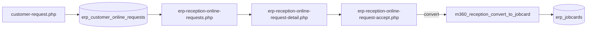

# MOGHARE360 P11.9-C-2A — Reception Full Capability Inventory Report

**Phase:** P11.9-C-2A  
**Mode:** Discovery / inventory / implementation plan only — **no code, SQL, Auth, or workflow changes**  
**Date:** 2026-07-04  
**Product:** MOGHARE360 V1 RC  
**Read-only SQL script:** `database/audit/P11_9_C_2A_READONLY_RECEPTION_CAPABILITY_INVENTORY.sql`  
**Prior phases:** P11.9-C-0 (discovery), P11.9-C-1 (CSRF/action stabilization)

> **Live DB note:** Cursor did not execute the read-only script against MOGHARE360_ERP. Operator must run the script in SSMS and attach output to close the live-object inventory loop.

---

## 1. Executive Summary

Reception in MOGHARE360 V1 RC is **not a unified workbench**. It is a **fragmented set of P1 online-request pages, P2 reception JobCard board/actions, P1.5 intake contracts, and separate JobCard/customer/vehicle utilities** linked from Staff Home for the `RECEPTION` role.

**Owner assessment is correct:** the primary visible “reception” entry (`erp-reception-online-requests.php`) behaves as an **online request list**, not a complete reception/intake file workflow. Offline walk-in admission has **no single guided page**. Intake completion fields (defect coding, camera photos, initial diag, cost agreement, belongings, fuel, incomplete-file queue) are **mostly absent from reception UI** even where related capabilities exist elsewhere (JobCard camera, diagnostic file upload, intake contracts post-JobCard).

**Foundations that must be reused (not rebuilt):**

| Layer | Existing foundation |
|-------|---------------------|
| P1 online | `erp_customer_online_requests`, history, `m360-reception-helper.php`, online list/detail/accept |
| P2 reception JobCard | `erp-reception-jobcards.php`, detail, action; `m360-reception-jobcard-helper.php`; P2 migration columns on `erp_jobcards` |
| P1.5 contracts | `erp_intake_contracts` + signatures/events; staff + customer sign pages |
| JobCard write | `moghare360_jobcard_v2_write()` via `m360_reception_convert_to_jobcard()` |
| Media | `erp-jobcard-camera-capture.php`, `submit-jobcard-camera-capture.php`, `moghare360-camera-media-helper.php` |
| Diagnostic file | `erp-jobcard-diagnostic-file.php`, Wave 2C helpers |
| Customer/vehicle | `erp-customer-vehicle-workbench.php`, create UX pages, public `customer-request.php` |

**Critical gaps:** no reception workbench shell; no intake completion wizard; no defect/fault catalog table or UI; convert-to-JobCard gates only OTP/customer/vehicle/plate (not full intake file); contracts are **post-JobCard** not pre-conversion intake file; HR shortcuts backlog-only.

**Stop / Continue:** **CONTINUE** to P11.9-C-2B (Reception Staff Workbench + Intake Completion Shell) using aggregation and wiring of existing modules — **no duplicate modules**, owner approval for any new schema (defect catalog, intake file entity).

---

## 2. Owner Concerns Interpreted

| Owner statement | Finding | Evidence |
|-----------------|---------|----------|
| Current reception page is not a true reception page | **Confirmed** — P1 list is online-request queue | `erp-reception-online-requests.php` |
| Only an online request list | **Confirmed** for primary entry; P2 JobCard board is separate | Staff Home RECEPTION → three cards, no unified shell |
| No complete option for incomplete intake files | **Confirmed** — detail is read-only grid + actions | `erp-reception-online-request-detail.php` |
| No visible full reception workflow despite prior SQL/code | **Confirmed** — workflow exists in code/SQL but UI is fragmented | P1/P2/P1.5 migrations + helpers; M33 UX guides are non-functional demos |
| SQL/code may contain coded subjects/categories | **Partial** — vehicle brand/class JS, `request_type`/`service_category` text fields; **no dedicated defect catalog** | `vehicle-brand-classes.js`; no `erp_defect*` in migrations searched |
| Must not create duplicate modules | **Mandatory for C-2B** — reuse listed foundations | This report §23 |

---

## 3. Current Reality: What Reception Is Today

For a reception staff member logging in via Staff Home (`erp-staff-home.php`, role `RECEPTION`):

1. **Today’s work starts at** “درخواست‌های آنلاین” → filtered table of `erp_customer_online_requests`.
2. **Detail page** shows customer/vehicle/request summary and POST actions (under review, accept, reject, convert) via `erp-reception-online-request-accept.php`.
3. **Separate path:** “JobCardهای پذیرش” → P2 board with reception-specific statuses and forms on `erp-reception-jobcard-detail.php`.
4. **Separate path:** “برد قراردادهای پذیرش” → P1.5 contract gate (generate/send/sign) **after** JobCard exists.
5. **No card** for walk-in admission, incomplete intake files, today’s admitted vehicles dashboard, customer response queue, or HR shortcuts.

Convert-to-JobCard **does run** (`m360_reception_convert_to_jobcard`) but creates a minimal JobCard from online payload — not a completed intake file.

---

## 4. Existing Code Route Inventory

### 4.1 Reception / online (P1)

| File | Role |
|------|------|
| `public_html/erp-reception-online-requests.php` | List + status filters |
| `public_html/erp-reception-online-request-detail.php` | Detail + action forms + convert gate panel (C-1) |
| `public_html/erp-reception-online-request-accept.php` | POST: under_review, accept, reject, convert_to_jobcard |
| `public_html/includes/m360-reception-helper.php` | List, status update, entity ensure, convert, CSRF (C-1) |
| `public_html/includes/m360-online-request-helper.php` | Table/column helpers, payload parse, history |

**Not found (by design after C-1):** `erp-reception-online-request-reject.php`, `-review.php`, `-convert.php` — all actions consolidated in `accept.php`.

### 4.2 Reception / JobCard (P2)

| File | Role |
|------|------|
| `public_html/erp-reception-jobcards.php` | Reception JobCard board |
| `public_html/erp-reception-jobcard-detail.php` | Reception forms (notes, inspection, workflow) |
| `public_html/erp-reception-jobcard-action.php` | POST workflow actions |
| `public_html/includes/m360-reception-jobcard-helper.php` | P2 reception JobCard queries/actions |

### 4.3 Intake contracts (P1.5)

| File | Role |
|------|------|
| `public_html/erp-intake-contracts.php` | Contract board |
| `public_html/erp-intake-contract-detail.php` | Contract detail |
| `public_html/erp-intake-contract-generate.php` | Generate draft |
| `public_html/erp-intake-contract-send.php` | Send to customer |
| `public_html/customer-intake-contract.php` | Customer view |
| `public_html/customer-intake-contract-sign.php` | Customer signature |
| `public_html/includes/m360-intake-contract-helper.php` | Contract logic |

### 4.4 Public intake (customer-facing P1)

| File | Role |
|------|------|
| `public_html/customer-request.php` | Public online request form |
| `public_html/api/customer/request.php` | API write path |

### 4.5 Offline / walk-in (fragmented)

| File | Role |
|------|------|
| `public_html/erp-jobcard-create-v2.php` | Controlled JobCard create — **requires** `customer_id` + `vehicle_id` |
| `public_html/erp-jobcard-create-ux.php` | **Display-only** M33 reception flow guide |
| `public_html/erp-customer-vehicle-create-ux.php` | Customer/vehicle create UX (separate from reception) |
| `public_html/erp-customer-vehicle-workbench.php` | Read-only lookup workbench |

**Not found:** `erp-reception-walk-in*`, `erp-admission*`, `erp-intake-wizard*`, `erp-vehicle-admission*`.

### 4.6 JobCard ecosystem (reception-adjacent, not reception-workbench)

| File | Role |
|------|------|
| `public_html/erp-jobcard-detail.php` | General JobCard detail |
| `public_html/erp-jobcard-workbench.php` | M33 read-only JobCard UX board |
| `public_html/erp-jobcard-camera-capture.php` | Camera-only capture (JobCard-scoped) |
| `public_html/submit-jobcard-camera-capture.php` | Camera submit handler |
| `public_html/erp-jobcard-diagnostic-file.php` | Controlled diag file upload |
| `public_html/submit-jobcard-diagnostic-file.php` | Diag submit handler |
| `public_html/includes/moghare360-camera-media-helper.php` | Media stages/types |
| `public_html/includes/moghare360-jobcard-v2-write.php` (or equivalent) | JobCard creation write path |

### 4.7 Staff entry / navigation

| File | Role |
|------|------|
| `public_html/erp-staff-home.php` | Role-based home |
| `public_html/includes/m360-staff-home-helper.php` | RECEPTION card groups |
| `public_html/includes/m360-navigation-registry.php` | Route registry references |

### 4.8 HR (exists globally, not reception-linked)

| File | Role |
|------|------|
| `public_html/erp-hr-dashboard.php` | HR dashboard |
| Attendance, payroll preview, employee profile pages | Phase 7 — Staff Home marks HR as **P15 backlog** for reception |

---

## 5. Existing SQL / DB Foundation Inventory

### 5.1 Migration files (repo evidence — not executed in C-2A)

| Migration | Objects / columns |
|-----------|-------------------|
| `database/migrations/P1_online_request_intake.sql` | `erp_customer_online_requests` extensions; `erp_customer_online_request_history` |
| `database/migrations/P2_reception_jobcard_workflow.sql` | `erp_jobcards`: `reception_notes`, `initial_inspection_notes`, `online_request_id`, `assigned_reception_user_id`, workflow statuses |
| `database/migrations/P1_5_intake_contract_signature.sql` | `erp_intake_contracts`, `erp_intake_contract_signatures`, `erp_intake_contract_events` |
| P3 / Wave 2 | `diagnosis_summary`, diagnosis timestamps on `erp_jobcards`; media evidence tables via Wave 2 helpers |

### 5.2 Core tables (expected on canonical DB)

| Table | Reception relevance |
|-------|---------------------|
| `erp_customer_online_requests` | Online intake queue |
| `erp_customer_online_request_history` | Request audit trail |
| `erp_jobcards` | JobCard + reception notes + online_request link |
| `erp_jobcard_change_history` | JobCard audit |
| `erp_intake_contracts` | Post-JobCard contract gate |
| `erp_customers`, `erp_vehicles`, `erp_customer_vehicle_relations` | Entity resolution on convert |
| `erp_service_operations` | Post-reception technical ops (P3+) — **not** intake defect catalog |

### 5.3 Not found in migrations (defect/intake file)

- No `erp_defect*`, `erp_fault*`, `erp_symptom*`, `erp_complaint_category*` table
- No dedicated `erp_intake_file` or `erp_reception_intake` aggregate table
- No pre-JobCard photo/diag attachment table separate from JobCard media (media is JobCard-bound)

### 5.4 Read-only live inventory

Run: `database/audit/P11_9_C_2A_READONLY_RECEPTION_CAPABILITY_INVENTORY.sql` in SSMS on `MOGHARE360_ERP` to confirm live object names, column probes, status distributions, and sample rows (test pollution visibility).

---

## 6. Existing Documentation / Blueprint Inventory

| Document | Content |
|----------|---------|
| `docs/audit/MOGHARE360_P11_9_C_0_RECEPTION_INTAKE_JOBCARD_DISCOVERY_REPORT.md` | Prior discovery; CSRF root cause (fixed C-1) |
| `docs/audit/MOGHARE360_P11_9_C_1_*` | Action stabilization scope + report |
| `docs/missions/p1_online_request_intake/` | P1 online intake mission |
| `docs/missions/p2_reception_operational_workflow/` | P2 reception JobCard workflow |
| `docs/missions/mission_33_*` / `M33_02_DAILY_RECEPTION_FLOW.md` | 4-step reception UX blueprint (guide pages only) |
| `docs/legal/MOGHARE360_INTAKE_CONTRACT_V1.md` | Legal contract text (P1.5) |
| `docs/architecture/MOGHARE360_MODULE_CONTRACT_MATRIX.md` | Notes structural gaps in operation modules |
| `database/dry-run/P11_9_A_READONLY_PREFLIGHT_CHECK.sql` | Preflight object checks |

---

## 7. Online Request Capability Map



| Capability | Status |
|------------|--------|
| Public submit + OTP | **Exists** |
| Staff list + filters | **Exists** (C-1 improved labels/counts) |
| Accept / reject / under review | **Exists** (single accept.php) |
| History audit | **Exists** (SQL + helper) |
| Entity auto-create on convert | **Exists** |
| Convert to JobCard | **Exists** — minimal fields only |
| Complete intake file on detail | **Missing** |
| Defect coding on detail | **Missing** |
| Photo/diag on detail pre-JobCard | **Missing** |

---

## 8. Offline / Walk-In Reception Capability Map

| Step | Expected (M33 blueprint) | Actual |
|------|--------------------------|--------|
| Customer identify/create | Guided reception | `erp-customer-vehicle-create-ux.php` (separate) |
| Vehicle identify/create | Guided reception | Same |
| Intake inspection + complaint | Single wizard | **Not implemented** |
| JobCard create | From completed intake | `erp-jobcard-create-v2.php` needs IDs upfront |
| UX guide | — | `erp-jobcard-create-ux.php` (**display only**) |

**Verdict:** Offline reception is **blueprint + fragmented utilities**, not an operational unified flow.

---

## 9. Intake File Completion Capability Map

| Intake section | Code | SQL | UI on reception detail |
|----------------|------|-----|------------------------|
| Customer/vehicle summary | Read from request row | P1 columns + payload JSON | Read-only display |
| Editable completion | **No** | Partial in payload | **No forms** |
| Belongings / fuel / damage | **No** | **No dedicated columns** | **No** |
| Defect coding | **No** | **No catalog table** | **No** |
| Photos | JobCard camera only | Media via JobCard | **Not on intake detail** |
| Initial diag | JobCard diagnostic file | JobCard columns | **Not on intake detail** |
| Contract / cost agreement | P1.5 post-JobCard | `erp_intake_contracts` | Separate board, not intake file |
| Incomplete file queue | **No** | **No** | **No** |

---

## 10. Customer Profile Capability Map

| Capability | Route | Reception-linked? |
|------------|-------|-------------------|
| Public customer profile | `customer-profile.php` | No direct link from reception |
| Staff customer/vehicle workbench | `erp-customer-vehicle-workbench.php` | Not on Staff Home RECEPTION cards |
| Auto-create on convert | `m360_reception_ensure_customer()` | On convert only |

---

## 11. Vehicle Profile Capability Map

| Capability | Route | Reception-linked? |
|------------|-------|-------------------|
| Vehicle detail UX | `erp-vehicle-detail-ux.php` | Read-only; not on reception home |
| Auto-create on convert | `m360_reception_ensure_vehicle()` | Plate/VIN from payload |
| Vehicle class dropdown (public) | `vehicle-brand-classes.js` on `customer-request.php` | Brand/model class — **not defect coding** |

---

## 12. Defect / Category Coding Capability Map

| Item | Finding |
|------|---------|
| Dedicated defect/fault/symptom catalog table | **Not found** in `database/migrations/` |
| `erp_service_operations` | Service **operations** on JobCard (P3+) — not intake complaint taxonomy |
| `service_category` / `request_type` on JobCard/request | Free-text / enum-like strings — **not structured coding UI** |
| Persian coding docs | Referenced in contract legal text (parts coding) — not intake UI |
| `vehicle-brand-classes.js` | Vehicle brand/model taxonomy — **misleading if confused with defect coding** |

**Verdict:** Defect/complaint coding is **blueprint-only / owner-spec** — requires owner-approved schema + UI in a later phase if canonical catalog is mandatory before JobCard.

---

## 13. Photo / Camera / Attachment Capability Map

| Capability | File | Scope | Reception intake? |
|------------|------|-------|-------------------|
| Camera capture | `erp-jobcard-camera-capture.php` | JobCard ID required | **Post-JobCard only** |
| Camera policy | `moghare360-camera-media-helper.php` | Camera direct; stages include `diagnostic_initial`, `damage` | Not wired to online detail |
| Media preview/timeline | `erp-jobcard-media-preview.php`, evidence timeline | JobCard | Separate module |
| Diagnostic file upload | `erp-jobcard-diagnostic-file.php` | Controlled PDF/image — **not camera** | Post-JobCard |

---

## 14. Initial Diag / Diagnostic Capability Map

| Layer | Finding |
|-------|---------|
| Reception initial diag UI | **Missing** on intake detail |
| JobCard diagnostic file (Wave 2C) | **Exists** — requires JobCard |
| P3 technical diagnosis board | `erp-technical-jobcard-detail.php` — **post-reception technical**, not intake |
| SQL | `diagnosis_summary` etc. on `erp_jobcards` (P3 migration) |

---

## 15. Contract / Agreement Capability Map

| Capability | Status |
|------------|--------|
| Intake contract legal text | **Exists** — `docs/legal/MOGHARE360_INTAKE_CONTRACT_V1.md` |
| DB + staff UI | **Exists** — P1.5 board/generate/send |
| Customer sign | **Exists** — `customer-intake-contract-sign.php` |
| Cost agreement separate from intake contract | **Not found** as distinct module |
| Timing in workflow | **After JobCard** — not a pre-convert gate today |

---

## 16. JobCard Conversion Capability Map

**Function:** `m360_reception_convert_to_jobcard()` in `m360-reception-helper.php`

**Current gates:**

- OTP verified (payload)
- Not rejected
- Customer create/resolve
- Vehicle create/resolve (plate required)
- Customer-vehicle relation
- `moghare360_jobcard_v2_write()` success

**Not gated today:** full intake checklist, defect coding, photos, diag file, signed contract, cost agreement, fuel/belongings/damage.

**C-1 addition:** Convert prerequisite messages surfaced as Persian gate panel on detail (not full intake shell).

---

## 17. Customer Response / Vehicle Status Capability Map

| Capability | Finding |
|------------|---------|
| Customer response queue for reception | **Not found** |
| “Today’s admitted vehicles” dashboard | **Not found** — P2 board is all reception JobCards, not “today admission” KPI card |
| Public status | `api/customer/profile-status.php` — customer-facing, not reception workbench |
| Follow-up | Fragmented via JobCard/contract boards |

---

## 18. Reception Staff HR Shortcut Capability Map

| HR capability | Exists in codebase | Linked from RECEPTION Staff Home |
|---------------|---------------------|----------------------------------|
| Employee profile | Yes (Phase 7) | **No** — P15 backlog |
| Attendance | Yes | **No** |
| Payroll / payslip | Yes | **No** |
| Leave / overtime | Yes | **No** |

---

## 19. Hidden / Partial / Duplicate Routes

| Route | Classification |
|-------|----------------|
| `erp-reception-online-requests.php` | **Primary** but incomplete vs owner vision |
| `erp-reception-jobcards.php` | **Valid P2** — hidden from “reception = online list” mental model |
| `erp-intake-contracts.php` | **Valid P1.5** — separate gate, not intake wizard step |
| `erp-jobcard-create-ux.php` | **Duplicate illusion** — looks like create, is demo-only |
| `erp-jobcard-workbench.php` | **Parallel UX** — M33 read-only; not reception operational board |
| `dist/moghare360-v1-local-demo-rc/public_html/erp-reception-*` | **Dist mirror** — not primary deploy path |
| Reject/review/convert PHP files | **Intentionally absent** — consolidated in accept.php |

---

## 20. Current UI Problems

1. P1 online pages use legacy soft-run styling vs green operational shell on P2.
2. No card-based reception workbench — flat Staff Home links only.
3. Online detail is a table summary, not a multi-section intake file.
4. No visible progress/checklist for intake completion.
5. Convert gate shows prerequisites but not a completion wizard.
6. Filter pills improved in C-1 but test data homogeneity still confuses operators.
7. M33 “reception flow” pages set false expectations (display-only create UX).

---

## 21. Current Workflow Problems

1. Online → convert creates **minimal** JobCard without intake enrichment.
2. Contracts run **after** JobCard — owner may expect contract before or as part of intake file.
3. Offline path requires knowing customer/vehicle IDs before JobCard create.
4. No `INCOMPLETE_INTAKE` status or queue.
5. Photo/diag modules require JobCard ID — chicken-and-egg if intake must precede JobCard.
6. No unified status spanning online request + intake file + JobCard + contract.

---

## 22. Current Data / Test Pollution Problems

| Pattern | Risk |
|---------|------|
| `MIRROR` source channel | Clutters production-like lists |
| Names containing `تست` / `TEST` | Filter/status testing noise |
| `TEST_V1_CANONICAL_DB_DO_NOT_USE` | Documented canonical DB guard patterns |
| Homogeneous `NEW`/`PENDING` rows | Makes filters appear broken |

**Recommendation:** Data cleanup is **operator/DB task**, not C-2B code scope unless owner approves dedicated purge script.

---

## 23. What Already Exists And Must Be Reused

1. **P1 online stack** — list, detail, accept, helpers, history table.
2. **P2 reception JobCard stack** — board, detail, action, helper.
3. **P1.5 intake contracts** — full generate/send/sign pipeline.
4. **`m360_reception_convert_to_jobcard()`** — extend gates, do not rewrite convert core.
5. **`moghare360_jobcard_v2_write()`** — single JobCard creation path.
6. **Camera + diagnostic file modules** — link from intake shell with JobCard ID once created OR owner-approved pre-JobCard staging.
7. **Staff Home RECEPTION groups** — extend, do not replace auth/roles.
8. **CSRF helpers from C-1** — `m360_reception_csrf_*`.

---

## 24. What Exists In SQL But Is Not Exposed In UI

| SQL object | Gap |
|------------|-----|
| `erp_customer_online_request_history` | Shown partially on detail; not full timeline UX |
| `request_payload_json` fields (odometer, etc.) | Parsed on convert; not editable on detail |
| `erp_jobcards.reception_notes` / `initial_inspection_notes` | P2 detail only — not online intake file |
| `erp_intake_contracts` | Board exists; not embedded in intake completion flow |
| P3 `diagnosis_summary` | Technical board — not reception intake |

---

## 25. What Exists In UI But Is Not Connected

| UI | Disconnect |
|----|------------|
| `erp-jobcard-camera-capture.php` | Not linked from online request detail / intake shell |
| `erp-jobcard-diagnostic-file.php` | Same |
| `erp-customer-vehicle-workbench.php` | Not on RECEPTION home |
| `erp-jobcard-create-v2.php` | Not linked as walk-in finale from reception |
| HR pages | Exist but Staff Home excludes for RECEPTION |

---

## 26. What Exists Only In Docs / Blueprint

- Unified reception workbench card layout (owner vision)
- M33 daily reception 4-step flow (guide pages only)
- Defect/complaint category catalog (Persian coding)
- Pre-JobCard intake file entity
- Cost agreement module distinct from P1.5 intake contract
- Reception HR shortcut strip (P15 backlog)
- “Today’s admissions” and “incomplete files” queues

---

## 27. What Is Truly Missing

1. **Reception Staff Workbench** shell (single entry, card grid).
2. **Intake completion shell** (multi-section form/checklist) for online + offline.
3. **Defect coding** data model + UI (owner approval).
4. **Incomplete intake queue** + status model.
5. **Walk-in guided flow** (customer → vehicle → intake → JobCard).
6. **Pre-convert enrichment** or explicit policy: convert early vs complete-first.
7. **Customer response / today status** reception cards.
8. **Reception ↔ media/diag** deep links in intake context.

---

## 28. Owner Approval Needed Items

| Item | Why approval |
|------|--------------|
| New defect/complaint catalog tables | No existing schema |
| New intake file aggregate table (optional) | vs extending online_request + JobCard columns |
| Convert gate policy: block until intake complete? | Business rule |
| Contract timing: before vs after JobCard | Workflow change |
| Pre-JobCard media staging | May need schema if photos before JobCard ID |
| Test data purge on canonical DB | Destructive data ops |
| HR shortcuts on reception workbench | P15 scope crossover |

---

## 29. Recommended Reception Workbench Architecture

**Principle:** One new **shell page** that **aggregates** existing routes — no duplicate convert/contract/JobCard modules.

```
erp-reception-workbench.php (NEW in C-2B)
├── Card: Online requests → erp-reception-online-requests.php
├── Card: Walk-in admission → wizard shell linking create-ux + jobcard-create-v2
├── Card: Incomplete intake files → filtered online detail + P2 drafts
├── Card: Today's JobCards → erp-reception-jobcards.php?filter=today
├── Card: Contracts gate → erp-intake-contracts.php
├── Card: Customer/vehicle lookup → erp-customer-vehicle-workbench.php
├── Card: HR shortcuts (optional P15) → existing HR routes
└── Intake completion panel (embedded or tab on detail)
    ├── Reuse payload + editable fields (where safe)
    ├── Deep link: camera/diag after JobCard ID
    └── Progress checklist (UI state; DB fields as available)
```

**Navigation:** Add workbench card to Staff Home RECEPTION **Today** group; keep existing pages reachable (do not delete).

---

## 30. Recommended Next Implementation Phase

See **§G — P11.9-C-2B proposal** below.

---

## 31. Stop / Continue Decision

| Decision | **CONTINUE** |
|----------|--------------|
| Rationale | Strong existing P1/P2/P1.5/code foundations; gaps are primarily **UI aggregation, intake shell, and wiring** — not greenfield ERP modules |
| Blockers | Owner approval for defect catalog schema and convert-gate policy |
| Do not proceed to | P12 scope, Auth changes, permission/role changes, new JobCard engine |

---

# Required Matrices

## Matrix 1 — Existing Route Matrix

| Capability | Existing page/file | Purpose | Visible to user? | Connected to workflow? | Connected to DB? | Current problem | Reuse / Fix / Replace / Backlog |
|------------|-------------------|---------|------------------|------------------------|------------------|-----------------|--------------------------------|
| Online request list | `erp-reception-online-requests.php` | Queue + filters | Yes (primary) | Yes | Yes | Not full reception | **Reuse** + workbench entry |
| Online request detail | `erp-reception-online-request-detail.php` | Summary + actions | Yes | Yes | Yes | Not intake file | **Fix** — add completion shell |
| Online actions | `erp-reception-online-request-accept.php` | Status + convert | Via detail | Yes | Yes | Was CSRF (fixed C-1) | **Reuse** |
| Convert to JobCard | `m360_reception_convert_to_jobcard()` | Create JobCard | Via detail | Yes | Yes | Minimal gate | **Reuse** + extend gates |
| Reception JobCard board | `erp-reception-jobcards.php` | P2 board | Yes (secondary) | Yes | Yes | Disconnected from P1 | **Reuse** + link |
| Reception JobCard detail | `erp-reception-jobcard-detail.php` | P2 forms | Yes | Yes | Yes | Not intake wizard | **Reuse** |
| Intake contracts | `erp-intake-contracts.php` | P1.5 gate | Yes (tertiary) | Yes | Yes | Post-JobCard only | **Reuse** |
| Public online intake | `customer-request.php` | Customer submit | Public | Yes | Yes | Test pollution | **Reuse** |
| Walk-in create guide | `erp-jobcard-create-ux.php` | UX demo | Hidden/low | No | No | Misleading | **Fix** or demote |
| JobCard create | `erp-jobcard-create-v2.php` | Write JobCard | Hidden | Yes | Yes | Needs IDs | **Reuse** in walk-in shell |
| Customer/vehicle WB | `erp-customer-vehicle-workbench.php` | Lookup | Hidden | Read-only | Yes | Not on home | **Reuse** + card |
| Camera capture | `erp-jobcard-camera-capture.php` | Photos | Hidden | Yes | Yes | JobCard-only | **Reuse** + link |
| Diag file | `erp-jobcard-diagnostic-file.php` | Diag upload | Hidden | Yes | Yes | JobCard-only | **Reuse** + link |
| HR dashboard | `erp-hr-dashboard.php` | HR | Hidden for RECEPTION | Yes | Yes | P15 backlog | **Backlog** |
| Staff Home RECEPTION | `erp-staff-home.php` | Entry | Yes | Partial | N/A | No workbench | **Fix** — add workbench card |
| Reject/review/convert pages | — | — | N/A | Consolidated | — | — | **N/A** (by design) |

---

## Matrix 2 — Existing SQL Object Matrix

| Business capability | Table/view/procedure/column | Object type | Evidence/source file | Current usage in code | UI exposed? | Gap | Recommended use |
|--------------------|----------------------------|-------------|----------------------|----------------------|-------------|-----|-----------------|
| Online requests | `erp_customer_online_requests` | Table | P1 migration | P1 helpers | Yes | Not intake editor | Extend UI binding |
| Request history | `erp_customer_online_request_history` | Table | P1 migration | detail/history | Partial | Weak timeline UX | Show in intake shell |
| Payload | `request_payload_json` | Column | P1 | convert parse | Read-only | Not editable | Intake form fields |
| JobCard link | `converted_jobcard_id` | Column | P1 | convert | Yes | — | Reuse |
| Reception notes | `erp_jobcards.reception_notes` | Column | P2 migration | P2 detail | P2 only | Not on P1 detail | Unified intake view |
| Online link | `erp_jobcards.online_request_id` | Column | P2 | convert write | P2 board | — | Reuse |
| Intake contracts | `erp_intake_contracts` | Table | P1.5 migration | contract helper | Yes | Not in intake wizard | Card + deep link |
| Signatures | `erp_intake_contract_signatures` | Table | P1.5 | sign flow | Customer UI | — | Reuse |
| Customers | `erp_customers` | Table | Core | ensure_customer | Indirect | — | Reuse |
| Vehicles | `erp_vehicles` | Table | Core | ensure_vehicle | Indirect | — | Reuse |
| Defect catalog | — | — | Not found | — | No | **Missing** | Owner-approved schema |
| Media | JobCard media tables | Table | Wave 2 | camera helper | JobCard pages | Not intake | Link post-ID |
| Diagnosis | `diagnosis_summary` | Column | P3 | technical | No on reception | — | Post-intake |

---

## Matrix 3 — Reception Workbench Required Card Matrix

| Card | Required for V1? | Exists now? | Existing route | Existing SQL foundation | Missing pieces | Recommended phase |
|------|------------------|-------------|----------------|-------------------------|----------------|-------------------|
| پروفایل پرسنلی پذیرشگر | Nice | Partial (HR) | `erp-hr-*` | HR tables | Staff Home link | P15 / optional C-2B stub |
| پذیرش خودرو حضوری | **Yes** | Partial | `erp-jobcard-create-ux.php` + `erp-jobcard-create-v2.php` | `erp_jobcards`, customers, vehicles | Guided wizard shell | **C-2B** |
| درخواست‌های آنلاین مشتری | **Yes** | Yes | `erp-reception-online-requests.php` | `erp_customer_online_requests` | Workbench card | **C-2B** |
| تکمیل پرونده پذیرش | **Yes** | No | detail (partial) | payload + P2 columns | Completion UI | **C-2B** |
| تبدیل به کارت کار | **Yes** | Yes | accept.php + helper | convert columns | Stricter gates (TBD) | C-2B policy |
| پروفایل خودرو | **Yes** | Partial | `erp-vehicle-detail-ux.php` | `erp_vehicles` | Reception link | **C-2B** |
| پاسخ‌گویی به مشتری | Yes | No | — | — | Module | Backlog after C-2B |
| وضعیت خودروهای پذیرش‌شده امروز | **Yes** | Partial | `erp-reception-jobcards.php` | `erp_jobcards` | Today filter KPI | **C-2B** |
| پرونده‌های ناقص | **Yes** | No | — | — | Status + queue | **C-2B** shell |
| هشدارهای پذیرش | Nice | Partial | convert gate panel | request status | Alert aggregation | C-2B |
| گزارش روزانه پذیرش | Nice | No | — | history tables | Report page | Post C-2B |

---

## Matrix 4 — Intake Completion Requirement Matrix

| Requirement | Existing code? | Existing SQL? | Existing docs? | Current UI? | Required before JobCard? | Gap | Recommended fix |
|-------------|----------------|---------------|----------------|-------------|--------------------------|-----|-----------------|
| مشخصات مشتری | Yes (ensure) | Yes | P1 | Read-only | Partial | Edit on detail | C-2B form section |
| موبایل و تأیید تماس | Yes (OTP) | payload | P1 | Display | Yes (convert) | — | Reuse |
| مشخصات خودرو | Yes (ensure) | Yes | P1 | Read-only | Partial | Edit | C-2B |
| پلاک | Yes | Yes | P1 | Display | Yes | — | Reuse |
| VIN / شاسی | Partial | vehicles | P1 | Partial | Owner TBD | Field exposure | C-2B |
| کیلومتر | Partial | payload | P1 | No | Owner TBD | UI | C-2B |
| سطح سوخت | No | No | Blueprint | No | Owner TBD | Schema? | Owner approval |
| لوازم داخل خودرو | No | No | Blueprint | No | Owner TBD | All | Owner approval |
| آسیب‌های ظاهری | No | No | Blueprint | No | Owner TBD | Camera link | C-2B + camera |
| شرح شکایت مشتری | Partial | service_note | P1 | Read-only | Yes | Edit | C-2B |
| انتخاب عیب از کدینگ اصلی | No | No | Blueprint | No | Owner TBD | Catalog | Owner approval |
| دسته‌بندی عیب | No | No | Blueprint | No | Owner TBD | Catalog | Owner approval |
| عکس مستقیم | Yes (JobCard) | media | Wave 2 | No on intake | Owner TBD | Link | C-2B deep link |
| دیاگ اولیه | Yes (JobCard file) | jobcards | Wave 2C | No on intake | Owner TBD | Link | C-2B |
| فایل/گزارش دیاگ | Yes | media | Wave 2C | JobCard page | Owner TBD | Link | Reuse |
| قرارداد پذیرش | Yes (P1.5) | contracts | Legal | Separate board | Owner TBD | Timing | Policy |
| قرارداد/توافق هزینه | No | No | Blueprint | No | Owner TBD | Module | Backlog |
| زمان تقریبی تحویل | No | No | Blueprint | No | Owner TBD | Field | C-2B / schema |
| رضایت/امضا | Yes (contract sign) | signatures | P1.5 | Customer | Owner TBD | Embed | Reuse |
| تأیید نهایی پذیرش | Partial | status | P1 | accept action | Partial | Checklist | C-2B |
| آماده تبدیل به کارت کار | Partial | convert | P1 | Button | Partial | Gates | C-2B |

---

## Matrix 5 — JobCard Conversion Gate Matrix

| Required data | Currently checked? | Existing source | Missing source | Should block conversion? | Message to user | Phase |
|---------------|-------------------|-----------------|----------------|--------------------------|-----------------|-------|
| OTP verified | **Yes** | payload | — | Yes | Persian (exists) | Done |
| Not rejected | **Yes** | request_status | — | Yes | exists | Done |
| Customer resolved | **Yes** | ensure_customer | — | Yes | exists | Done |
| Vehicle / plate | **Yes** | ensure_vehicle | — | Yes | exists | Done |
| Customer-vehicle relation | **Yes** | ensure_relation | — | Yes | exists | Done |
| Full intake checklist | **No** | — | UI checklist | **Owner TBD** | C-2B gate copy | C-2B |
| Defect coding | **No** | — | catalog | **Owner TBD** | — | Post-schema |
| Photos | **No** | JobCard media | intake link | **Owner TBD** | — | C-2B |
| Initial diag | **No** | diag file | intake link | **Owner TBD** | — | C-2B |
| Signed intake contract | **No** | P1.5 | workflow order | **Owner TBD** | — | Policy |
| Cost agreement | **No** | — | module | **Owner TBD** | — | Backlog |

---

## Matrix 6 — UI Quality Matrix

| Page | Current UX problem | Severity | Business impact | Recommended redesign | UI-only? | Requires workflow? | Requires DB? |
|------|-------------------|----------|-----------------|----------------------|----------|-------------------|--------------|
| `erp-reception-online-requests.php` | List-only, legacy CSS | High | Owner distrust | Workbench entry + shell | Partial | No | No |
| `erp-reception-online-request-detail.php` | Not intake file | Critical | Blocks operations | Completion sections | Partial | Yes | Partial |
| `erp-reception-jobcards.php` | Disconnected from P1 | Medium | Fragmentation | Unified nav | Yes | No | No |
| `erp-jobcard-create-ux.php` | Fake create form | High | Misleading staff | Demote or wire | Yes | Yes | No |
| Staff Home RECEPTION | No workbench | High | Wrong entry point | Add workbench card | Yes | No | No |

---

## Matrix 7 — Risk Matrix

| Risk | Impact | Cause | Mitigation | Next phase |
|------|--------|-------|------------|------------|
| Duplicate modules | High | Rebuilding convert/contract | Reuse map §23 | C-2B scope lock |
| Convert before intake complete | High | Current minimal gate | Owner policy + UI checklist | C-2B |
| Pre-JobCard photos | Medium | JobCard ID required | Staging policy or convert-first | Owner approval |
| Defect catalog absent | Medium | No schema | Owner-approved migration | Post-C-2B or C-2B if approved |
| Test data noise | Low | Mirror/test rows | SSMS cleanup | Operator |
| CSRF regression | High | Multi-form tokens | C-1 helpers | Test in C-2B |
| Scope creep to P12 | High | Workbench ambition | Forbidden files list | C-2B charter |

---

# F — Required Persian Executive Answers

1. **آیا الان صفحه پذیرش واقعی وجود دارد؟**  
   خیر — صفحه واحد و جامع «پذیرش» وجود ندارد؛ فقط ماژول‌های پراکنده P1 (درخواست آنلاین)، P2 (JobCard پذیرش) و P1.5 (قرارداد) داریم.

2. **آیا صفحه فعلی فقط لیست درخواست آنلاین است؟**  
   بله — از دید کاربر پذیرش، نقطه ورود اصلی (`erp-reception-online-requests.php`) عملاً لیست درخواست آنلاین است.

3. **آیا پذیرش حضوری در UI موجود است یا پنهان/ناقص است؟**  
   ناقص و پراکنده — راهنمای UX (`erp-jobcard-create-ux.php`) نمایشی است و ثبت واقعی از `erp-jobcard-create-v2.php` با شناسه مشتری/خودرو از قبل لازم است؛ جریان واحد walk-in وجود ندارد.

4. **آیا کدینگ عیوب در SQL یا فایل‌ها وجود دارد؟**  
   خیر — جدول/کاتالوگ اختصاصی عیب در migrationها یافت نشد؛ فقط فیلدهای متنی مانند `request_type`/`service_category` و طبقه‌بندی برند خودرو در JS عمومی.

5. **آیا تکمیل پرونده قبل از JobCard وجود دارد؟**  
   خیر — جزئیات درخواست آنلاین خلاصه read-only است؛ تبدیل با حداقل داده (OTP، مشتری، خودرو، پلاک) انجام می‌شود.

6. **آیا عکس، دیاگ، قرارداد و توافق هزینه قبلاً ساخته شده‌اند یا فقط Blueprint هستند؟**  
   عکس (دوربین JobCard) و فایل دیاگ و قرارداد P1.5 **ساخته شده** اما به JobCard/برد قرارداد وابسته‌اند، نه به پرونده پذیرش یکپارچه؛ **توافق هزینه** جداگانه یافت نشد (Blueprint).

7. **آیا تبدیل به کارت کار باید تا تکمیل پرونده قفل باشد؟**  
   امروز **قفل نیست** — تصمیم کسب‌وکار است؛ فنیاً OTP و موجودیت‌ها چک می‌شوند. توصیه: سیاست مالک در C-2B.

8. **آیا Workbench پذیرش باید صفحه جدید باشد یا از صفحات موجود تجمیع شود؟**  
   **تجمیع** — یک shell جدید (`erp-reception-workbench.php`) که به مسیرهای موجود لینک دهد؛ بدون تکرار ماژول.

9. **کدام صفحات باید حذف نشوند ولی از مسیر اصلی خارج شوند؟**  
   `erp-jobcard-create-ux.php` (نمایشی)، `erp-jobcard-workbench.php` (M33 read-only)، dist mirrors — demote از مسیر عملیاتی؛ صفحات P1/P2/P1.5 عملیاتی **حذف نشوند**.

10. **کمترین فاز اجرایی بعدی برای تکمیل جامع پذیرش چیست؟**  
    **P11.9-C-2B — Reception Staff Workbench + Intake Completion Shell** (تجمیع UI، چک‌لیست تکمیل، لینک walk-in و media/diag، بدون Auth/SQL مخرب).

---

# G — P11.9-C-2B Proposal (Not Implemented in C-2A)

## P11.9-C-2B — Reception Staff Workbench + Intake Completion Shell

### Scope

- Add `erp-reception-workbench.php` — card-based reception entry for `RECEPTION` role.
- Extend `erp-reception-online-request-detail.php` with **intake completion sections** (checklist UI, editable safe fields from payload, progress indicator).
- Add walk-in **shell** page linking `erp-customer-vehicle-create-ux.php` → intake sections → `erp-jobcard-create-v2.php` (no new write engine).
- Wire deep links to existing `erp-jobcard-camera-capture.php` and `erp-jobcard-diagnostic-file.php` when `jobcard_id` available.
- Update `m360-staff-home-helper.php` RECEPTION **Today** group with workbench primary card.
- Optional: today filter on `erp-reception-jobcards.php` query param only (no schema change).

### Allowed files (indicative)

- `public_html/erp-reception-workbench.php` (new)
- `public_html/erp-reception-walk-in-shell.php` (new, optional name)
- `public_html/erp-reception-online-request-detail.php`
- `public_html/erp-reception-online-requests.php` (nav links only)
- `public_html/erp-reception-jobcards.php` (today filter if needed)
- `public_html/includes/m360-reception-helper.php` (intake checklist helpers, no Auth change)
- `public_html/includes/m360-staff-home-helper.php` (workbench card)
- `public_html/includes/m360-reception-intake-shell-helper.php` (new helper, optional)
- Tests under existing test conventions for C-2B

### Forbidden files

- `staff-auth.php`, `access-control.php`, auth/login stack
- Permission/role/department/position definitions
- `database/migrations/*` (unless owner pre-approves defect catalog — separate phase)
- Workflow action handlers core logic change beyond intake messaging
- OTP internals
- P12 scope files
- Private/secrets files
- Destructive SQL

### Reuse targets (no duplicate module rule)

- All P1 online routes + `m360_reception_convert_to_jobcard()`
- P2 reception JobCard board/detail/action
- P1.5 intake contracts pipeline
- `moghare360_jobcard_v2_write()`, camera, diagnostic file modules
- C-1 CSRF helpers

### Test plan

1. Staff Home RECEPTION → workbench loads with all cards.
2. Online request → detail shows intake checklist sections.
3. Convert still works with C-1 CSRF (single token).
4. Walk-in shell navigates to existing create paths without new write duplication.
5. Camera/diag links open only when JobCard ID present.
6. Scope test: forbidden files untouched.
7. Production signoff suite extended for C-2B.

### Browser validation

- Login as reception staff → workbench → online list → detail → actions.
- Walk-in shell navigation (happy path with test customer/vehicle IDs).
- Mobile-width layout for workbench cards.

### Stop conditions

- Owner rejects workbench-as-shell approach (requires alternative UX spec).
- Owner mandates defect catalog schema before any C-2B UI (pause for migration phase).
- Any change would require Auth/permission modification — **stop**.
- Duplicate convert/contract module detected in implementation — **stop and remap**.

---

P11.9-C-2A completes a full reception capability inventory across existing code, SQL foundations, documentation, online requests, offline intake, intake completion, JobCard conversion, customer/vehicle profile, defect coding, photo/diag/contract capabilities, and reception workbench gaps before implementation, without changing code, SQL, Auth/Login, permissions, roles, workflow, users, JobCards, OTP, private files, secrets, or P12 scope.
